# 기억결 (Memorystone)

<!-- TODO(D-5): 배너 이미지 — 트레일러 스틸 또는 키아트. ReadMeSource/00.Banner.png -->

> 이 리포는 **소스 열람용 발췌**이며 빌드 대상이 아닙니다. 씬·아트·오디오·서드파티 에셋·데이터 CSV는 포함하지 않습니다.
> 발췌 기준: Plastic SCM `/main/dev` **cs:1391** (2026-09-06). README의 파일 경로와 코드 발췌는 전부 이 리포 안의 파일입니다.

- **장르** : 턴제 헥스 전술 · 덱빌딩 로그라이크
- **도구** : Unity 6000.3 · C# · Plastic SCM · Claude Code / Codex + Unity MCP
- **팀** : 2인 (프로그래밍 1 · 아트 1)
- **플랫폼** : PC
- **기간** : 2026-05 → 2026-09
- **수상** : 제1회 서울 플레이업 AI 게임 챌린지 353팀 중 상위 8팀 · 2026 GES 전시

<br>

# ❗개요

서울을 무대로 한 턴제 헥스 전술 덱빌딩 로그라이크입니다. 플레이어는 이동 덱과 행동 덱 두 벌로 육각 타일 위를 움직이고, 몬스터는 다음 턴의 행동을 미리 예고합니다.

코드는 세 축으로 나뉩니다. **규칙층은 순수 C#**(UnityEngine 참조가 컴파일 단계에서 금지된 어셈블리 3개)이고, **연출은 규칙이 남긴 산출물에서 파생**되며, **밸런스는 코드가 아니라 CSV**에 있습니다.

구현의 대부분은 AI(Claude Code · Codex)가 썼습니다. 이 README는 「무엇을 만들었나」보다 **어떤 구조가 무엇을 막고 무엇을 대가로 치르는지**, 그리고 AI 네이티브 개발에서 **사람이 책임진 영역**(기획 · 판단 · 검증)이 어디였는지를 시스템별로 정리합니다. 근거가 없는 문장은 쓰지 않았고, 각 절 끝에 근거(파일 경로 · 결정 번호 · 체인지셋)를 적었습니다.

<br>

# 📜 목차

**시스템**

0. [코드베이스 구조](#0-코드베이스-구조)
1. [육각 맵과 이동](#1-육각-맵과-이동)
2. [경로탐색 BFS 전환](#2-경로탐색-bfs-전환)
3. [턴 페이즈와 턴 경계](#3-턴-페이즈와-턴-경계)
4. [몬스터 AI와 예고](#4-몬스터-ai와-예고)
5. [공격 형상 문법](#5-공격-형상-문법)
6. [암시야와 정보 은닉](#6-암시야와-정보-은닉)
7. [연출 타임라인](#7-연출-타임라인)
8. [카드와 덱 두 벌](#8-카드와-덱-두-벌)
9. [세이브와 재현성](#9-세이브와-재현성)
10. [배치 랜덤화](#10-배치-랜덤화)
11. [데이터 파이프라인](#11-데이터-파이프라인)
12. [맵 에디터](#12-맵-에디터)

**개발 방식**

13. [검증 인프라](#13-검증-인프라)
14. [AI 네이티브 작업 방식](#14-ai-네이티브-작업-방식)

**영상**

- [🕹️ 인게임 영상](#️-인게임-영상)

<br>

# 🖥️ 개발 내용

## 0. 코드베이스 구조

<p align="center"></p>

자작 어셈블리는 19개(`.asmdef`)이고, 참조는 전부 아래를 향합니다. `Flow`(씬 전환·로비) → `Combat`(전투 표현) → `Cards.Unity` · `Map.Unity` · `Audio` · `Tutorial` → `Combat.Runtime`(전투 규칙) → `CardCore` · `Map.Runtime`. 이 중 아래 셋에 `noEngineReferences: true`가 붙어 있습니다.

| 어셈블리 | 역할 | 규모 (cs:1391) |
|---|---|---:|
| `Combat.Runtime` | 전투 규칙 — 턴·카드 효과·몬스터 계획·타임라인 조립 | 263파일 · 45,827줄 |
| `Map.Runtime` | 육각 좌표 · 경로탐색 · 가시성 · 배치 | 34파일 · 4,542줄 |
| `CardCore` | 카드 정의 · 덱 상태 | 12파일 · 1,932줄 |

이 플래그는 어셈블리에 자동으로 딸려오는 `UnityEngine.dll` 참조를 끕니다. 그 안에서는 `MonoBehaviour`도 `Debug.Log`도 타입 자체가 존재하지 않아, 규칙 코드에 엔진이 새어 들어오면 컴파일이 깨집니다. 「순수 C# 계층을 존중하라」는 문장은 작업 규칙 문서에도 있지만, 실제로 그것을 지키게 만드는 것은 문장이 아니라 이 플래그입니다.

규칙층의 중심은 `CombatState`입니다. 생성자가 맵 · 설정 · 지형표 · 카드/몬스터/보스 카탈로그 · 덱 두 벌 · 인벤토리 · 런 시드를 **전부 인자로** 받습니다. 규칙층 안에 싱글턴도 `Resources.Load`도 정적 카탈로그 참조도 없다는 뜻이고, 그래서 EditMode 테스트가 씬 없이 어떤 상황이든 인자로 조립해 돌릴 수 있습니다.

### 규칙은 연출을 모른다 — 연출이 규칙을 가지러 온다

<p align="center"></p>

순수 C#과 Unity가 실제로 만나는 자리입니다. 연출을 받는 인터페이스 `ICombatPresentationSink`는 `Source/Combat/Unity/Presentation/`에 있고, `CombatState`는 `noEngineReferences` 어셈블리라 그것을 참조할 수 없습니다. 그래서 규칙은 「몬스터가 저 칸으로 걸어갔다」를 직접 화면에 알리지 않고, `CombatTimeline`(비트 목록)이라는 **자료구조만 남깁니다.** 조립기 `CombatTimelineAssembler`를 부르는 코드는 전부 Unity 쪽 `MapCombatController.Presentation.cs`에 있고, 규칙은 조립기의 존재조차 모릅니다.

순서를 정하는 두 클래스는 둘 다 엔진 참조가 없습니다. `CombatTimelineAssembler`는 `Combat.Runtime` 안에 있고, `PresentationScheduler`는 `Combat`(Unity) 어셈블리에 있지만 파일 안에 `UnityEngine` using이 하나도 없습니다. 이동은 한 칸씩, 효과는 프로파일이 정한 간격만큼 벌려 내보내는 큐 하나가 「모든 것이 한 프레임에」 겹치던 문제를 해결했다고 스케줄러 주석이 적고 있습니다.

### 이 시스템에서 중점을 둔 것

**경계를 문서가 아니라 컴파일러가 지키게 하는 것.** 참조 방향은 당부가 아니라 `asmdef`가, 개발 전용 코드는 `UNITY_EDITOR` 제약이, MCP 도구 어셈블리는 `UNITY_MCP_READY` 정의 제약이 막습니다(MCP가 없는 환경에서는 컴파일 자체가 안 되므로 남이 클론해도 깨지지 않습니다). 같은 판단이 이 README의 다른 절에서 반복됩니다 — 성능 회귀는 사람 눈이 아니라 골든 베이스라인이(13절), 데이터 정합은 리뷰가 아니라 감사 툴이(11절) 잡습니다.

### 코드

`Source/Combat/Runtime/SeoulPlayup.Combat.Runtime.asmdef` — 규칙 어셈블리 정의 전문입니다.

```json
{
    "name": "SeoulPlayup.Combat.Runtime",
    "rootNamespace": "SeoulPlayup.Combat.Runtime",
    "references": [
        "SeoulPlayup.CardCore",
        "SeoulPlayup.Map.Runtime"
    ],
    "includePlatforms": [],
    "excludePlatforms": [],
    "allowUnsafeCode": false,
    "overrideReferences": false,
    "precompiledReferences": [],
    "autoReferenced": true,
    "defineConstraints": [],
    "versionDefines": [],
    "noEngineReferences": true
}
```

`Source/Combat/Runtime/CombatState.cs` — 생성자 앞부분. 난수원과 계획기를 시드로부터 만들고, 이후 모든 상태는 인자에서 옵니다.

```csharp
        public CombatState(HexMapData map, HexCoord playerCoord, IEnumerable<MonsterConfig> monsterConfigs, CombatConfig config, HexTerrainTable terrainTable = null, CardCatalogDefinition cardCatalog = null, MonsterCatalogDefinition monsterCatalog = null, HexTerrainTraits terrainTraits = null, PlayerInventoryState playerInventory = null, PlayerDeckData playerDeck = null, CardDeckState movementDeck = null, CardDeckState actionDeck = null, bool drawOpeningHands = true, bool shuffleDecks = false, BossCatalogDefinition bossCatalog = null, int? runSeed = null)
        {
            // 🔑 런 시드(seed-determinism-handoff). null = 무시드(테스트·랩·구세이브) — 아래 난수원들이
            // 각자 무시드 폴백을 탄다. 값이 있으면 RunSeedStreams 표의 스트림으로 갈라 쓴다.
            RunSeed = runSeed;
            pushRng = runSeed.HasValue
                ? CreateStreamRandom(RunSeedStreams.CombatJudgement)
                : new System.Random();
            // 계획 레이어는 컨텍스트 참조만 들고 있으므로 여기서 가장 먼저 만들어도 안전하다
            // (필드 이니셜라이저에서는 this를 쓸 수 없어 생성자에서 만든다).
            // 은신·실명 마스킹과 프로파일(매복)은 IMonsterPlanningContext의 술어 셋으로 계획기가 직접 읽는다
            // (DEC-2026-09-05-03 — 종전 IMonsterAi 데코레이터 스택을 접었다). 실계획·미리보기가 같은 술어를 지난다.
            planner = new MonsterAiPlanner(
                this,
                attackPatternSeed: runSeed.HasValue ? RunSeedStreams.Derive(runSeed.Value, RunSeedStreams.MonsterAttackPattern) : 0);
            Map = map;
            PlayerCoord = playerCoord;
            Config = config;
            PlayerInventory = (playerInventory ?? new PlayerInventoryState()).Clone();
```

### 트레이드오프 · 남은 문제

- **구조 판단의 「왜」가 기록에 없습니다.** 규칙층 분리 · 타임라인 자료구조화 · `Combat.Contracts` 신설은 결정 로그(첫 항목 2026-07-02)가 시작되기 전에 이미 서 있었습니다. 그래서 이 절은 구조가 **무엇을 막는지**까지만 설명하고, 누가 왜 그렇게 골랐는지는 주장하지 않습니다.
- **`Combat.Contracts`는 이름과 달리 순수하지 않습니다.** 5파일 572줄 중 `CombatTimingProfile.cs`가 `ScriptableObject`이고, `noEngineReferences`는 `false`이며 `Combat.Runtime`을 참조합니다. 「순수 C#」이라 부를 수 있는 경계는 위 표의 세 어셈블리뿐입니다. 어떤 순환을 끊으려고 만들었는지도 기록이 없습니다.
- **규칙층에서 엔진을 못 쓰는 대가**는 규칙 안의 디버그 흔적입니다. `CombatState`에는 「표현/디버그 전용이며 규칙은 이 값을 읽지 않는다」고 주석 단 문자열 필드(`LastTrapSpawnReport`)처럼, `Debug.Log` 대신 값을 남겨 바깥에서 읽게 하는 우회가 있습니다.
- **`CombatState`는 partial 34파일 · 14,556줄입니다.** 파일은 잘게 쪼개져 있지만 클래스 하나가 이만큼을 압니다. 분할 자체가 경계를 만들지는 않습니다(3절 · 8절에서 다시 다룹니다).

> 근거 · `Source/**/*.asmdef` 19개 전수 · `Source/Combat/Runtime/CombatState.cs` 생성자 · `Source/Combat/Unity/Presentation/PresentationScheduler.cs` 머리 주석 · `Source/Combat/Unity/MapCombatController.Presentation.cs` 조립기 호출부 4곳 · 규모는 이 리포(cs:1391)에서 `find | wc -l`로 실측

<br>

## 1. 육각 맵과 이동

<p align="center">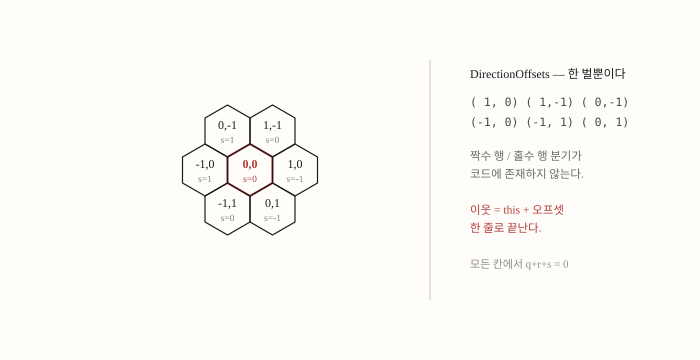</p>

육각 격자의 골칫거리는 행마다 반 칸씩 어긋난다는 것입니다. (행, 열)로 저장하면 짝수 행과 홀수 행의 이웃 계산식이 달라져 이웃 코드가 두 벌이 됩니다. 이 프로젝트는 축을 세 개 두고 `q + r + s = 0` 제약을 거는 **축좌표(axial)** 를 씁니다. `HexCoord`는 Q·R 둘만 저장하고 S는 `-Q - R`로 유도합니다. S를 필드로 두면 Q·R과 어긋난 값이 저장될 수 있지만, 계산 프로퍼티로 두면 불일치가 존재할 자리 자체가 없습니다.

이 좌표계를 고르면 나머지가 따라옵니다. 이웃 6개는 오프셋 표 한 벌과 덧셈, 거리는 세 축 차이의 절댓값 합을 2로 나눈 것, 60° 회전은 좌표 순환 한 번(삼각함수도 행렬도 없는 정수 연산)입니다. 몬스터 공격 형상을 6방향으로 돌릴 때 이 회전을 씁니다(5절). 방향 판정은 큐브 공간 내적의 최대값으로 고르되, 동점이면 `HexDirection` enum 순서가 이기도록 `>=`가 아니라 `>`로 비교합니다. 같은 입력에 항상 같은 예고가 나와야 하기 때문입니다.

**어디까지가 표준이고 어디부터가 이 프로젝트 것인가.** 축좌표 저장 · 거리 공식 · 큐브 회전 · pointy-top 배치식 · 큐브 반올림은 널리 정리된 표준 기법(Red Blob Games 헥스 가이드)을 그대로 따른 것입니다. 이 게임 때문에 생긴 것은 아래 둘입니다.

| 요소 | 표준인가 | 비고 |
|---|---|---|
| 축좌표 저장 + S 유도 · 거리 · 60° 회전 · 배치식 · 큐브 반올림 | 표준 | 레퍼런스 그대로 |
| 방향 판정의 동점 규약 | 절반 | 내적은 표준. 동점을 enum 순서로 고정한 것은 결정성 판단 |
| `TryRaycastHeightPlanes` — 높이 있는 맵의 피킹 | 고유 | 헥스 문헌은 대개 평면 격자만 다룬다 |
| `FootprintRadius` 원판 클리어런스 — 멀티셀 유닛 | 고유 | 경로탐색기를 새로 만들지 않고 술어 한 겹으로 얻는다 |

<p align="center">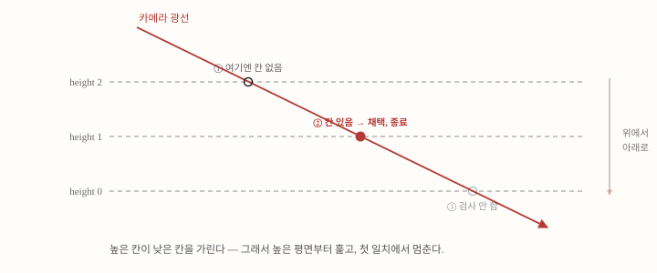</p>

**클릭 판정은 콜라이더 없이 수학으로 합니다.** 화면은 2D인데 맵에는 높이가 있어, 같은 화면 좌표가 낮은 칸을 가리킬 수도 그 뒤의 높은 칸을 가리킬 수도 있습니다. `TryRaycastHeightPlanes`는 광선을 높이 평면마다 교차시켜 후보 좌표를 얻고, 그 높이에 실제로 칸이 있는지 확인해야 채택합니다. 씬에 구울 클릭 콜라이더가 0개가 되는 대신, 물리 상호작용과 레이어 기반 판정처럼 콜라이더가 공짜로 주던 것을 포기했고, 칸의 옆면은 클릭 대상이 아니라는 top-face-only 계약이 생겼습니다.

<p align="center">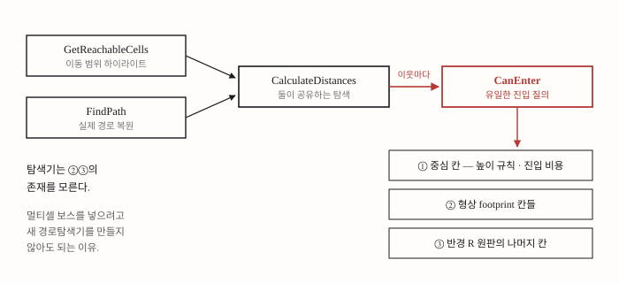</p>

### 이 시스템에서 중점을 둔 것

**진입 판정을 한 곳에 모으는 것.** 이동 범위 하이라이트(`GetReachableCells`)와 실제 경로(`FindPath`)가 같은 탐색을 공유하고, 탐색은 진입 가능성을 `CanEnter` 하나로만 묻습니다. 그래서 「하이라이트에 뜬 칸인데 못 가는」 불일치가 구조적으로 생기지 않습니다. 몸이 여러 칸인 몬스터(원판 반경 · 삼각형 footprint)도 이 술어에 한 겹을 더해 얻었습니다. 원판 바깥 칸에는 높이 규칙을 적용하지 않고(`from`을 `null`로 넘김) 진입 비용도 중심 칸 것을 씁니다. 몸이 여러 칸이면 높이차를 걸치는 것이 정상이고, 칸마다 다시 물으면 완만한 경사조차 통과 불가가 되기 때문입니다. 덩치 큰 몬스터가 자기 몸이 깔고 있는 칸을 통과하는 데는 예외 처리가 없습니다. 점유 판정이 애초에 「다른 유닛이 있는가」를 묻기 때문에 자기 자신은 저절로 통과합니다.

### 코드

`Source/Map/Runtime/HexCoord.cs` — 거리와 회전.

```csharp
        public int DistanceTo(HexCoord other)
        {
            return (Math.Abs(Q - other.Q) + Math.Abs(R - other.R) + Math.Abs(S - other.S)) / 2;
        }

        public HexCoord RotateSteps(int rotationSteps)
        {
            var steps = Math.Max(0, Math.Min(5, rotationSteps));
            var q = Q;
            var r = R;
            for (var i = 0; i < steps; i++)
            {
                var nextQ = -r;
                var nextR = q + r;
                q = nextQ;
                r = nextR;
            }

            return new HexCoord(q, r);
        }
```

`Source/Map/Runtime/HexPathfinder.cs` — `CanEnter`의 원판 클리어런스 부분.

```csharp
            if (query.FootprintRadius <= 0)
            {
                return true;
            }

            // 원판의 나머지 칸. 높이 규칙은 중심에만 적용한다(몸이 여러 칸이면 높이차를 걸치는 것이
            // 정상이고, 칸마다 다시 물으면 완만한 경사조차 통과 불가가 된다) — 그래서 from은 null이다.
            // 진입 비용도 중심 칸의 것을 그대로 쓴다: 몸이 커졌다고 한 칸 전진이 비싸지지는 않는다.
            foreach (var coord in HexArea.CellsWithin(destination, query.FootprintRadius))
            {
                if (coord == destination)
                {
                    continue;
                }

                if (!CanEnterCell(map, null, coord, query, runtimeStates, terrainTraits, out _))
                {
                    return false;
                }
            }
```

### 트레이드오프 · 남은 문제

- **「맵 시스템 1만 줄」이 아닙니다.** 이 절이 설명한 좌표계 · 거리 · 회전 · 방향 · 피킹은 `Map.Runtime` 4,542줄 중 약 360줄이고, 그중 좌표계 · 거리 · 회전은 표준 기법입니다. 순수 C# 쪽의 가장 큰 덩어리는 배치 랜덤화(10절)이고, `Map.Unity`는 규칙 코드의 약 세 배인 표현 코드입니다. 이 비대칭이 어셈블리를 가른 이유이기도 합니다. 규칙은 씬 없이 테스트되고, 표현은 사람이 눈으로 봐야 합니다.
- **콜라이더 없는 피킹의 대가**는 물리 · 레이어 판정의 부재와 top-face-only 계약입니다. 칸 옆면 클릭은 지원하지 않습니다.
- **멀티셀 유닛이 언제 왜 필요해졌는지**는 기록이 없습니다. `FootprintRadius` 기본값이 0인 이유를 코드는 말하지 않습니다.

> 근거 · `Source/Map/Runtime/HexCoord.cs` · `Source/Map/Runtime/HexPathfinder.cs` `CanEnter` 주석 원문 · `Source/Map/Runtime/HexAxialProjection.cs` · 표준/고유 구분은 Red Blob Games 헥스 가이드 대조 · cs:1391

<br>

## 2. 경로탐색 BFS 전환

<p align="center">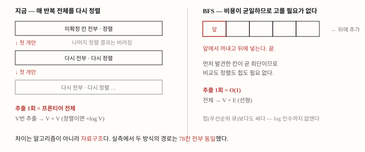</p>

이 절은 이 리포에서 가장 최근의 변경(cs:1354, 2026-09-05)이고, 코드를 읽다가 발견한 결함을 재고 고친 기록입니다.

`HexPathfinder.CalculateDistances`는 원래 다익스트라였습니다. 지형별 이동 비용이 다르다는 전제로, 매 반복 프론티어에서 누적 비용이 가장 작은 칸을 골랐습니다. 그런데 그 「고르는 법」이 우선순위 큐가 아니라 **프론티어 전체를 LINQ로 정렬한 뒤 첫 개만 쓰고 버리는** 것이었고, 동점 처리 3중(비용 → 발견 순서 → Q → R) 중 뒤의 둘은 발견 순서가 이미 유일해서 절대 실행되지 않는 죽은 코드였습니다.

더 중요한 발견은 **다익스트라일 이유가 이미 사라져 있었다**는 것입니다. 출하 맵을 만드는 유일한 경로인 `HexSparseMapAuthoringSource`가 진입 비용에 리터럴 `1`을 넘기고, 프리셋 카탈로그에는 비용을 저작할 필드조차 없습니다. 비용 2 · 3을 가진 지형 정의 여섯 개가 데이터에 남아 있지만 옛 경로의 잔재이고, 실제 스테이지가 쓰는 프리셋과 하나도 겹치지 않았습니다. 즉 모든 칸의 비용이 1이었습니다.

비용이 균일하면 「가장 싼 것」을 고를 필요가 없습니다. 먼저 발견한 칸이 곧 최단이므로 FIFO 큐 하나면 되고, 우선순위 큐보다도 쌉니다(log 인수까지 사라집니다). 바꾼 것은 알고리즘의 답이 아니라 자료구조입니다. Stage_1 실제 맵(1,938칸 · 도달 가능 875칸)에서 전환 전후의 경로는 최원거리 78칸이 전부 동일했습니다. 성능 변경이지 동작 변경이 아닙니다.

### 이 시스템에서 중점을 둔 것

**전제를 문서가 아니라 코드로 강제하는 것.** BFS는 비용이 균일할 때만 옳고, 전제가 깨지면 조용히 틀린 경로가 나옵니다. 그것이 이 변경의 유일한 위험이라, 진입 비용이 1이 아니면 그 자리에서 `InvalidOperationException`을 던지게 했고 가드가 실제로 던지는지 테스트(`NonUniformEnterCostThrowsInsteadOfSilentlyWrongPaths`)로 잠갔습니다. 틀릴 수 있게 두고 주의하는 대신, 틀리면 소리가 나게 만든 것입니다.

**결정성은 오히려 좋아졌습니다.** 예고와 실제 이동이 어긋나면 플레이어가 예고를 믿지 않게 됩니다. BFS의 FIFO 순서는 기존 계약(같은 거리 안에서 발견 순서)과 자연히 일치하고, 이웃 확장이 `NeighborsInDirectionOrder`로 고정이라 같은 입력에 항상 같은 경로가 나옵니다. 힙으로 갔다면 힙이 동점 순서를 보장하지 않아 비교자에 발견 순서를 직접 재현해야 했습니다.

### 코드

`Source/Map/Runtime/HexPathfinder.cs` — BFS 본체. 첫 발견이 곧 최단이라 갱신(relaxation)이 없고, 균일 비용 가드가 그 자리에서 던집니다.

```csharp
                foreach (var neighbor in current.NeighborsInDirectionOrder())
                {
                    if (distances.ContainsKey(neighbor))
                    {
                        // 균일 비용이므로 첫 발견이 곧 최단이다 — 갱신(relaxation)이 필요 없다.
                        continue;
                    }

                    if (!CanEnter(map, current, neighbor, query, runtimeStates, terrainTraits, out var enterCost))
                    {
                        continue;
                    }

                    if (enterCost != UniformStepCost)
                    {
                        throw new System.InvalidOperationException(
                            $"HexPathfinder는 균일 진입 비용({UniformStepCost})을 전제로 BFS를 돈다. " +
                            $"{neighbor}의 진입 비용이 {enterCost}다. 지형별 이동 비용을 되살리려면 " +
                            "CalculateDistances를 힙 기반 다익스트라로 되돌려야 한다.");
                    }
```

### 트레이드오프 · 남은 문제

- **잃은 것은 지형별 이동 비용의 여지입니다.** 「늪은 2칸 소모」류 규칙은 앞으로도 넣지 않기로 확정했습니다(DEC-2026-09-05-01, 사용자 결정). 되살리려면 이 함수를 힙 기반 다익스트라로 되돌리고 동점 순서를 비교자에 넣어야 합니다. 그 경로는 주석에 적어 두었습니다.
- **기각한 대안.** 힙 다익스트라(비용 축은 살지만 느리고 동점 순서 재현 부담). A\*(`GetReachableCells`는 목표가 없어 추정치를 쓸 자리가 없고, `FindPath`만 떼면 두 함수가 탐색을 공유해 얻던 「하이라이트에 떴는데 못 가는 일이 없다」는 보장이 깨짐). `CanEnter`가 항상 1을 반환하게 바꾸기(비용값을 읽는 코드가 남아 있어 표면이 넓어짐). 전제를 문서로만 적기(이 프로젝트의 일관된 판단과 어긋남).
- **측정의 한계.** 전후 비교는 Unity 에디터에서 했고, 실제 게임 루프에서 추격 경로가 턴당 몇 번 도는지는 계측하지 않았습니다. 이 README에는 그 수치를 싣지 않습니다.
- **`MovePoints`의 의미가 바뀌었습니다.** 「누적 비용」에서 「걸음 수」로 확정됐고, 이동 카드 문안(「최대 N칸 이동」)과 같은 것을 셉니다. 폐기된 비용 축을 단언하던 테스트 2건을 걸음 수 계약으로 고쳤습니다.

> 근거 · DEC-2026-09-05-01 · `Source/Map/Runtime/HexPathfinder.cs` · `Source/Map/Unity/HexSparseMapAuthoringSource.cs`(리터럴 `1`) · `Tests/EditMode/Map/Runtime/HexPathfinderTests.cs` · cs:1354 체크인, 실측 2026-09-05 에디터

<br>

## 3. 턴 페이즈와 턴 경계

<p align="center">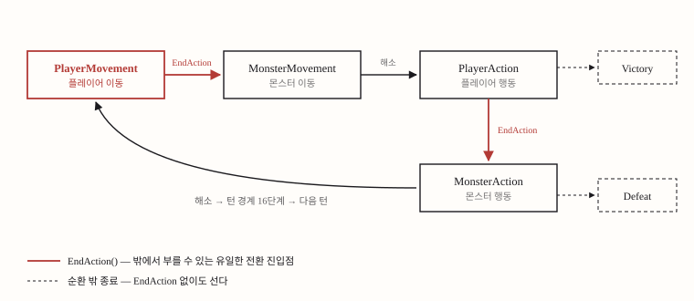</p>

페이즈는 enum 6개입니다. `PlayerMovement` · `MonsterMovement` · `PlayerAction` · `MonsterAction` · `Victory` · `Defeat`. 이동과 행동이 분리돼 있고 그 사이사이에 몬스터가 끼어듭니다. 전환을 실제로 집행하는 `SetPhase`는 private이고, 바깥에서 정상 순환을 넘기는 공개 진입점은 `EndAction()` 하나입니다. 이 구조는 1차 프로토타입 제출본에 담겨 나갔고 이후 플레이테스트가 전부 그 위에서 이뤄져, 2026-07-03에 정식 계약으로 확정됐습니다(DEC-2026-07-03-02, 사용자 결정). 그때 옛 계약(「이동 성공 시 즉시 행동 페이즈」)을 전제한 테스트 86건을 코드 쪽에 맞춰 정합했고, 대조 중 코드 결함으로 판명된 건은 코드를 고쳤습니다.

전환 경로가 여럿이면(이동해도 넘어가고, 카드를 다 써도 넘어가고, 기력이 0이어도 넘어간다면) 조합이 폭발하고 그중 하나에서 생긴 이상 상태는 재현이 어렵습니다. 입구가 하나면 「페이즈가 왜 넘어갔지?」의 답이 항상 하나이고, 코드가 그 자리에서 순서를 보장할 수 있습니다. **공격 예고가 커밋되는 시점**이 정확히 그 자리입니다. `EndAction`의 이동 분기가 `CommitMonsterAttackIntentsAfterPlayerMovementEnd()`를 부른 뒤 페이즈를 넘기므로, 「이동을 마치면 적이 무엇을 할지 확정되고, 그 다음에야 내가 행동한다」는 게임의 리듬이 코드 한 곳에서 결정됩니다.

다만 「`EndAction` 하나가 모든 전환을 맡는다」는 정상 순환에 대해서만 맞습니다. `Victory`와 `Defeat`는 그 밖에서도 서고, `Defeat` 중 하나는 몬스터 행동을 해소하는 도중에 섭니다. 정확한 문장은 「정상 페이즈 순환의 유일한 트리거가 `EndAction`, 종료 페이즈는 별도 경로」입니다.

<p align="center">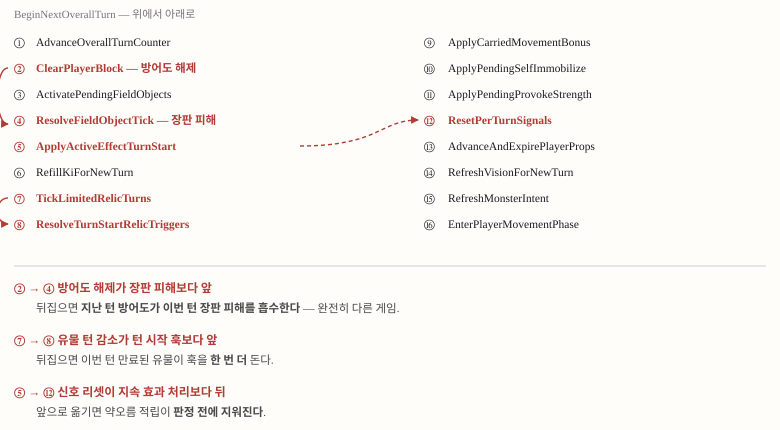</p>

### 순서가 곧 게임 규칙이다

몬스터 행동이 해소되면 `BeginNextOverallTurn`이 돕니다. 16단계이고 각 단계가 이름 붙은 private 메서드라, 본문 16줄을 위에서 아래로 읽으면 턴 경계의 규칙이 목차처럼 읽힙니다. 그중 세 쌍에는 「이 단계보다 앞/뒤여야 한다」는 이유가 주석으로 박혀 있습니다. 대표가 「방어도 소거는 필드 틱보다 앞」입니다. 두 줄의 순서를 바꾸면 지난 턴 방어도가 이번 턴 장판 피해를 흡수하는, 즉 「방어도를 쌓아두면 다음 턴 장판을 막을 수 있는 게임」이 됩니다. 버그가 아니라 다른 게임이고, 플레이어의 최적 전략이 바뀝니다.

16단계 중 다섯 개는 **예약을 소진하는** 단계입니다. 카드나 유물이 「다음 턴에 ~한다」를 약속하면 그 자리에서 실행하지 않고 예약해 두었다가 턴 경계에서 실현합니다. 예약을 미뤄 두면 예고를 만드는 계산과 실제 집행이 같은 값을 보게 되고, 이것이 4절의 「예고한 대로 일어난다」와 같은 원칙입니다.

### 이 시스템에서 중점을 둔 것

**순서 계약을 배치가 아니라 결과로 잠그는 것.** 순서 제약을 주석에 적는 것만으로는 다음 리팩토링에서 줄이 옮겨질 때 조용히 깨집니다. 그렇다고 「단계가 이 순서로 불렸는가」를 재는 테스트는 배열을 배열과 대조하는 것에 불과해, 이름만 바뀌어도 깨지고 정작 규칙이 깨져도 순서만 맞으면 통과합니다. 그래서 단언은 관찰 가능한 결과로 씁니다. 「지난 턴에 방어도를 쌓고 턴을 넘긴 뒤, 장판 위에서 피해를 온전히 받는가」처럼요.

어느 계약이 실제로 잠겨 있는지는 **돌연변이 검사**로 확인했습니다. 턴 경계 계약 24개를 표로 만들고 하나씩 뒤집어 본 결과 대부분은 기존 테스트가 이미 잡고 있었고, 안 잡히던 잔여물만 `TurnBoundaryContractTests`에 담았습니다. 같은 검사에서 진단이 틀렸던 사례도 남아 있습니다. 「강화 예약 소진이 예고 갱신보다 앞이어야 한다」를 순서 계약으로 판정했는데, 뒤집어 보니 예고가 요청 시점에 계산되므로 전후가 결과를 바꾸지 않았습니다. 지켜야 하는 것은 순서가 아니라 「경계를 넘긴 예약이 예고에 반영된다」는 결과였고, 테스트를 그렇게 다시 썼습니다. `BeginNextOverallTurn`의 주석은 이 사실을 「여기 배치를 근거로 규칙을 추론하지 말 것, 규칙은 테스트들이 들고 있다」고 적어 두었습니다.

### 코드

`Source/Combat/Runtime/CombatState.cs` — `EndAction`의 이동 페이즈 분기. 예고 커밋이 페이즈 전환 직전에 있습니다.

```csharp
            if (Phase == CombatPhase.PlayerMovement)
            {
                lastMonsterActionRecords.Clear();
                pendingMonsterActionRecords = null;
                CommitMonsterAttackIntentsAfterPlayerMovementEnd();
                SetPhase(CombatPhase.MonsterMovement);
                return true;
            }
```

`Source/Combat/Runtime/CombatState.cs` — 턴 경계 16단계 본문.

```csharp
        private void BeginNextOverallTurn(int freshStatusStartIndex)
        {
            AdvanceOverallTurnCounterStep();
            ClearPlayerBlockStep();
            ActivatePendingFieldObjects();
            ResolveFieldObjectTickStep();
            ApplyActiveEffectTurnStart(freshStatusStartIndex);
            RefillKiForNewTurnStep();
            TickLimitedRelicTurnsStep();
            ResolveTurnStartRelicTriggers();
            ApplyCarriedMovementBonusStep();
            ApplyPendingSelfImmobilize();
            ApplyPendingProvokeStrength();
            ResetPerTurnSignalsStep();
            AdvanceAndExpirePlayerProps();
            RefreshVisionForNewTurnStep();
            RefreshMonsterIntentStep();
            EnterPlayerMovementPhaseStep();
        }
```

### 트레이드오프 · 남은 문제

- **순서 의존이 암묵적입니다.** 세 쌍의 제약은 주석과 테스트로만 지켜지고 타입이 막아 주지 않습니다. 중앙 상태 객체 + 페이즈 enum 방식의 구조적 비용입니다.
- **예약 슬롯이 아직 카드 이름입니다.** `PendingEffects`는 흩어져 있던 `pending*` 필드 8개(그중 셋이 같은 (Amount, Turns) 쌍)를 타입 하나로 모으고 병합 규칙을 한 곳으로 옮겼지만, 슬롯은 여전히 카드별 필드(`agility` · `selfImmobilize` · `provokeStrength` …)입니다. 새 카드가 「다음 턴에 ~한다」를 하려면 필드를 또 추가해야 합니다. 목록 + 소진 시점 enum으로 더 가지 않은 이유도 기록돼 있습니다. 네 예약이 16단계의 서로 다른 세 지점에서 소진되고 그 사이에 유물 훅이 끼므로, 한꺼번에 꺼내면 턴 시작에 예약을 거는 유물이 생기는 순간 그 예약이 조용히 사라집니다. 슬롯이 8개, 10개로 늘어나는 시점이 전환점이라고 판단했습니다.
- **스펙과 코드가 드리프트했습니다.** 턴 구조 스펙은 턴 시작을 5단계로 적고 코드는 16단계입니다. 5단계가 규칙 수준의 골격이고 나머지는 그 뒤에 붙은 기능(유물 턴 감소 · 기 회복 · 추진력 이월 · 프롭 만료 등)이지만, 스펙의 마지막 갱신은 2026-07-05입니다. 스펙 조항마다 테스트를 붙이는 장치는 적힌 조항이 깨지는 것은 막지만, 새 기능이 문서에 안 들어오는 것은 못 막습니다.
- **커맨드 큐를 안 쓴 대가.** 이 게임에는 중단 저장이 있어 상태 스냅샷을 직접 직렬화해야 하고, 그래서 저장 왕복 검증용 감사 툴을 따로 만들어야 했습니다. 이 갈림길은 7절 · 9절에서 다시 다룹니다.
- **이동과 행동을 왜 분리했는지**는 기록이 없습니다.

> 근거 · DEC-2026-07-03-02 · `Source/Combat/Runtime/CombatState.cs`(`EndAction` · `BeginNextOverallTurn` 주석) · `Source/Combat/Runtime/CombatPhase.cs` · `Source/Combat/Runtime/PendingEffects.cs` 파일 주석 · `Tests/EditMode/Combat/TurnBoundaryContractTests.cs` 파일 주석 · cs:1391

<br>

## 4. 몬스터 AI와 예고

<p align="center">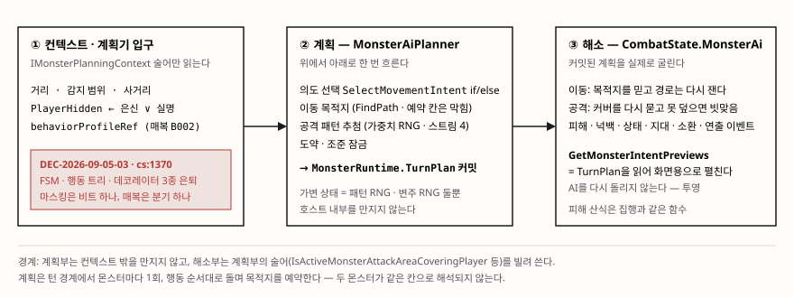</p>

몬스터 AI는 **규칙 기반 턴 계획기**입니다. 몬스터마다 ① 컨텍스트(거리 · 감지 · 마스킹) → ② 이동 의도(`SelectMovementIntent`, if/else 한 함수) → ③ 이동 목적지 → ④ 공격 패턴 추첨 → ⑤ 도약 → ⑥ `TurnPlan` 커밋이 위에서 아래로 한 번 흐릅니다. 계획을 실제로 굴리는 해소부(피해 · 넉백 · 상태이상 · 연출 이벤트)는 `CombatState`의 파셜에 남고, 계획기 `MonsterAiPlanner`는 `IMonsterPlanningContext` 인터페이스 밖의 상태를 건드리지 않습니다. 계획기가 소유한 가변 상태는 공격 패턴 추첨 난수원뿐입니다.

의도 선택은 2026-09-05까지 세 형식이 섞여 있었습니다. 상태기계 `MonsterFsm`, 복합 노드 없는 6노드 선택기 `MonsterBehaviorTreeAi`, 그리고 실제 결정(칸 · 패턴 · 조준)을 전부 하는 계획기의 절차 코드. 조사 결과 둘은 한 체인지셋에 함께 들어왔고 어느 쪽을 택한 기록이 없었으며, 출하 경로는 트리만 썼고 FSM의 `Step`은 출하 호출이 0이었습니다. 둘은 동치도 아니었습니다(트리는 순찰 중 사거리 안이면 즉시 공격하고 추격 이탈 임계가 감지 범위와 같으며, FSM은 한 턴 지연과 히스테리시스가 있음). 성능을 재 봤더니 형식 차이는 계획 비용의 1% 미만이라 선택 기준에서 제외됐고, **if/else 한 함수로 통일**했습니다(DEC-2026-09-05-03, cs:1370, 사용자 결정). 규칙은 출하 트리의 의미 그대로 한 줄도 바꾸지 않았고, 은신 · 실명 마스킹은 컨텍스트의 `PlayerHidden` 한 비트로, 매복은 프로파일 분기로 접었습니다.

<p align="center">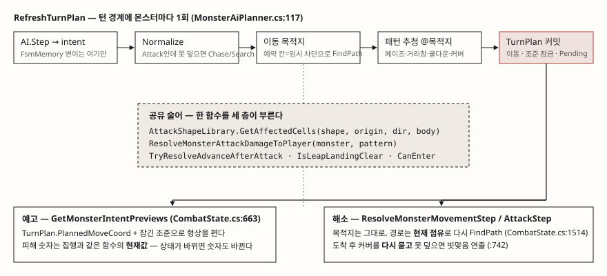</p>

### 예고가 곧 플랜

스펙 문장 「몬스터별 이동 목적지는 계획 시점에 예약되어 두 몬스터가 같은 타일로 해석되는 일이 없다. 프리뷰가 곧 플랜이며, 해석 결과와 일치한다」는 코드에서 세 조각입니다.

1. **예약.** `RefreshAllIntents`가 행동 순서대로 돌며 목적지를 `reservedDestinations`에 쌓고, 뒤 몬스터의 경로탐색에는 그 칸을 `temporaryBlocked` 런타임 상태로 끼워 넣습니다. 경로탐색기가 예약을 모르는 채로 예약이 성립합니다.
2. **예고는 재계산이 아니라 투영.** `GetMonsterIntentPreviews`는 AI를 다시 돌리지 않고 `TurnPlan`의 목적지와 잠긴 조준을 읽어 집행과 같은 함수로 칸을 폅니다. 피해 숫자도 집행과 같은 산식을 공유해, 「예고 수치 = 실제 피해」를 테스트가 아니라 구조가 지킵니다.
3. **해소는 목적지를 믿고 경로는 다시 잽니다.** 앞 몬스터가 밀려났거나 플레이어가 밀렸으면 경로가 달라질 수 있고, 도착 후 커버를 다시 물어 못 덮으면 빗맞음 연출로 갑니다.

그러니까 보장되는 것은 「예고한 칸 집합 = 명중 판정 칸 집합」이지 「예고했으면 맞는다」가 아닙니다. 계획과 결과는 갈릴 수 있고, 갈리면 규칙은 그것을 숨기지 않고 빗맞음으로 보이게 합니다.

### 이 시스템에서 중점을 둔 것

**예고 정직성을 테스트로 뒤쫓는 대신 함수 공유로 잠그는 것.** 형상 · 피해 · 전진 · 도약 착지가 예고와 집행에서 같은 함수입니다. 그리고 **지능을 형식이 아니라 데이터와 절차 코드에 두는 것.** 다양성은 패턴 × 형상 × 거리 창 × 페이즈 창 × 쿨다운으로 CSV에 살고, 몬스터를 추가할 때 코드가 아니라 데이터를 씁니다. 통일 결정의 근거도 그 연장입니다. 결정의 무게가 후보 필터 6단계에 있어 트리 리프 하나가 LINQ 파이프라인을 품게 되고, 「예고 = 플랜」이 커밋 지점 하나를 요구하는데 트리로 가면 커밋이 리프 둘로 갈립니다.

### 코드

`Source/Combat/Runtime/MonsterAiPlanner.cs` — 목적지 예약. 앞 몬스터의 목적지가 뒤 몬스터에게는 막힌 칸이 됩니다.

```csharp
            var reservedDestinations = new HashSet<HexCoord>();
            foreach (var monster in context.MonsterActionOrder())
            {
                monster.ActivityState = context.ClassifyMonsterActivity(monster);
                if (monster.Combatant.IsDead || monster.ActivityState == MonsterActivityState.Dormant)
                {
                    var intent = new EnemyIntent(EnemyIntentType.Patrol, PlayerCoord.DistanceTo(monster.Coord), monster.Coord, PlayerCoord);
                    monster.Intent = intent;
                    monster.LockedFacingIntent = intent;
                    monster.IntentPredictedMoveCoord = monster.Coord;
                    monster.PendingAttackIntent = false;
                    monster.PlannedLeap = false;
                    monster.TurnPlan = MonsterTurnPlan.Inactive(monster.Coord);
                    continue;
                }

                RefreshTurnPlan(monster, reservedDestinations, preserveCommittedAttackRolls);
                if (monster.TurnPlan.IsActive)
                {
                    reservedDestinations.Add(monster.TurnPlan.PlannedMoveCoord);
                }
            }
```

`Source/Combat/Runtime/MonsterAiPlanner.cs` — 의도 선택의 앞부분. 매복 · 사망 · 사거리 · 감지가 위에서 아래로 겹칩니다.

```csharp
        internal static EnemyIntent SelectMovementIntent(MonsterFsmContext ctx, MonsterFsmMemory memory, string behaviorProfileRef)
        {
            memory = memory ?? new MonsterFsmMemory();
            var distance = ctx.DistanceToPlayer;

            // 매복(요괴 §4-6 ③): 사거리 밖·은신·플레이어 사망이면 아래를 아예 돌리지 않는다(기억 무변경·경계 감쇠 없음).
            if (MonsterBehaviorProfileRegistry.IsAmbush(behaviorProfileRef)
                && (ctx.PlayerIsDead || ctx.PlayerHidden || distance > MonsterBehaviorProfileRegistry.AmbushRange))
            {
                return new EnemyIntent(EnemyIntentType.Return, distance, ctx.MonsterCoord, ctx.PlayerCoord);
            }

            if (memory.State == MonsterFsmState.Alert)
            {
                memory.State = memory.PreAlertState;
            }

            MonsterFsmState next;
            if (ctx.PlayerIsDead)
            {
                next = MonsterFsmState.Patrol;
            }
            else if (!ctx.PlayerHidden && distance <= ctx.AttackRange)
            {
                next = MonsterFsmState.Attack;
                memory.LastKnownPlayerCoord = ctx.PlayerCoord;
            }
            else if (!ctx.PlayerHidden && distance <= GetEffectiveChaseRange(ctx, memory))
            {
                next = MonsterFsmState.Chase;
                memory.LastKnownPlayerCoord = ctx.PlayerCoord;
            }
```

### 트레이드오프 · 남은 문제

- **위치 결정이 1걸음짜리입니다.** 공격 자리 잡기는 인접 6칸만 보고, 이동력 2 · 3인 몬스터도 「두 칸 앞 어느 자리가 형상을 맞추기 좋은가」를 계산하지 않습니다. 후퇴 · 거리 유지 갈래도 없어서, 「붙으면 안전」으로 저작된 형상을 든 몬스터도 접근만 합니다. 저작 의도(거리 싸움)와 이동 정책(접근)이 어긋납니다. 다만 이 계보(Into the Breach · Slay the Spire)의 게임은 적이 예측 가능해야 성립하고, 형상마다 「뒤가 안전」 「붙으면 안전」을 저작한 것은 플레이어가 적의 단순한 이동을 전제로 자리를 잡는 게임이라는 뜻입니다. 더 똑똑한 AI가 더 좋은 AI인지는 이 게임에서 자명하지 않고, 실플레이로 판정할 문제입니다.
- **의도 enum이 행동을 말하지 않습니다.** 「상태는 Chase, 행동은 공격」이 생깁니다. FSM은 정수 `range`로, 계획부는 형상(칸 집합)으로 판단하고, 22개 패턴에서 둘이 다릅니다. 예고 배지가 통째로 빠지는 결함의 원인이었고 `PendingAttackIntent`로 우회했지만 축이 두 개라는 사실은 남아 있습니다.
- **통일이 남긴 이름.** `MonsterFsmContext` · `MonsterFsmMemory` · `MonsterFsmState`는 세이브 와이어에 걸려 개명을 미뤘고, `CombatState.MonsterAi.cs` 머리의 「의사결정 트리 = IMonsterAi(MonsterBehaviorTreeAi)」 주석은 cs:1391에도 그대로 남아 있습니다. 코드는 바뀌었는데 주석이 안 따라온 자리입니다.
- **죽은 컬럼.** 몬스터 카탈로그의 `detectionRange`는 파서까지만 오고 규칙 소비자가 0입니다. 실제 감지 범위는 씬 설정 하나가 전 몬스터 공통이고, 도감은 그 죽은 값을 「N칸 안을 살피고」로 표시합니다. 배선하면 밸런스가 바뀌므로 사용자 결정 대기입니다.
- **기각한 대안.** 트리 100%(커밋이 둘로 갈림) · FSM 100%(공격 변형 다섯이 상태를 부풀림) · 인터페이스만 남기고 구현 하나(데코레이터를 위해서만 존재하는 인터페이스) · 히스테리시스 규칙 채택(실플레이 판정 없이 규칙을 바꾸는 것은 범위 밖).

> 근거 · DEC-2026-09-05-03 · `Source/Combat/Runtime/MonsterAiPlanner.cs` 파일 주석 · `Source/Combat/Runtime/CombatState.MonsterAi.cs` · `Tests/EditMode/Combat/MonsterIntentSelectionTests.cs` · 통일 cs:1370, 돌연변이 검사 3회

<br>

## 5. 공격 형상 문법

<p align="center">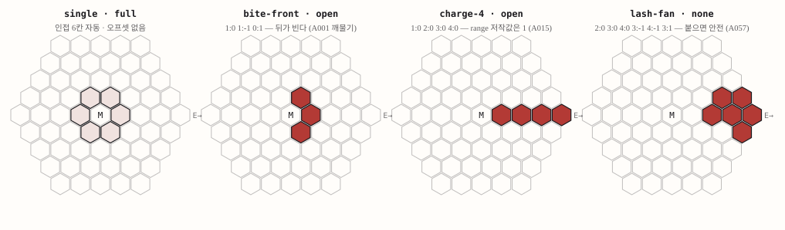</p>

몬스터 공격 범위는 코드가 아니라 `attack_shapes.csv`에 **정동(East) 기준 오프셋**으로 저작됩니다. 실행 시 조준 방향에 맞춰 1절의 `RotateSteps`로 돌리고, 조준 방향은 잠긴 플레이어 좌표를 향한 `ApproximateDirection`입니다. 방향 enum이 반시계인데 회전이 시계 방향이라 회전 수는 `(6 − dir) % 6`으로 뒤집힙니다. 몸이 여러 칸이면 원점을 조준 방향 앞 몸통 칸으로 옮깁니다.

형상의 어휘 중 핵심은 `adjacency` 컬럼입니다. 예전의 bool 하나(「인접 링을 깔까」)를 다섯 값으로 늘렸습니다.

| 값 | 인접 6칸 | 뜻 |
|---|---|---|
| `full` | 자동으로 깔린다 | 기본값. 옛 데이터와 플레이어 카드가 바이트 동일하게 남는다 |
| `open` | 안 깔린다 | 원하는 인접 칸만 직접 저작한다 |
| `none` | 안 깔리고 **거리 1 저작을 거부**한다 | 「붙으면 안전」 계약을 파서가 보증한다 |
| `body` | 몸 둘레 | 셀 집합을 저작하지 않고 footprint의 이웃 − 점유 칸으로 실행 시점에 편다. 회전 없음 |
| `body-shell` | 둘레의 둘레 | footprint에서 거리 2 껍질. 「붙어라」 계약 |

`open`과 `none`은 실행 코드에서는 같습니다(둘 다 링을 안 깝니다). 그런데도 둘을 가른 이유는 **파서**에 있습니다. `none`은 모든 오프셋이 거리 2 이상일 때만 통과하므로, 「붙으면 안전」이라고 저작한 형상이 실수로 인접 칸을 치는 일이 데이터 로드 시점에 막힙니다.

### 이 시스템에서 중점을 둔 것

**저작 계약을 파서가 지키게 하는 것.** 형상은 데이터라 코드 리뷰를 거치지 않고, 그래서 계약 위반은 파서에서 던져야 합니다. 링을 빼면서 오프셋도 없는 형상(아무것도 못 맞힘), `none`인데 거리 1 오프셋이 있는 형상, `body-shell`인데 오프셋을 적은 형상은 전부 로드 시점에 `ArgumentException`입니다. 예외 메시지에 「붙어도 맞아야 하는 형상이면 `open`으로 저작한다」처럼 고치는 법까지 적어, 저작자가 코드를 열지 않고도 답을 얻게 했습니다.

### 코드

`Source/Combat/Runtime/AttackShapeCatalogCsv.cs` — 인접성 가드.

```csharp
                if (adjacency != AttackShapeAdjacency.Full
                    && adjacency != AttackShapeAdjacency.Body
                    && adjacency != AttackShapeAdjacency.BodyShell
                    && offsets.Length == 0)
                {
                    throw new ArgumentException(
                        $"{row.FileName}:{row.LineNumber} shape '{shapeId}' opts out of the adjacent ring but has no offsets — it would hit nothing.");
                }

                if (adjacency == AttackShapeAdjacency.None)
                {
                    var tooClose = offsets.Where(offset => HexDistanceFromOrigin(offset) < 2).ToList();
                    if (tooClose.Count > 0)
                    {
                        throw new ArgumentException(
                            $"{row.FileName}:{row.LineNumber} shape '{shapeId}' is adjacency=none but has distance-1 offsets"
                            + $" ({string.Join(" ", tooClose.Select(o => $"{o.Q}:{o.R}"))}) —"
                            + " 링 없는 형상은 전 칸이 거리 2 이상이어야 '붙으면 안전' 계약이 성립한다."
                            + " 붙어도 맞아야 하는 형상이면 adjacency=open으로 저작한다.");
                    }
                }

                shapes.Add(new AttackShapeDefinition(shapeId, offsets, adjacency));
```

`Source/Combat/Runtime/AttackShapeLibrary.cs` — 방향 정렬.

```csharp
            var origin = body.ResolveShapeOrigin(monsterCoord, attackDirection);

            // RotateSteps(n) rotates clockwise; direction enum is counter-clockwise,
            // so (6 - d) % 6 clockwise steps align canonical East offsets to direction d.
            var rotationSteps = (6 - (int)attackDirection) % 6;
            var extraOffsets = shape.Offsets.Select(offset => offset.RotateSteps(rotationSteps));
            var offsets = shape.IncludeAdjacentRing ? AdjacentOffsetsInternal.Concat(extraOffsets) : extraOffsets;
```

### 트레이드오프 · 남은 문제

- **`range` 컬럼과 형상 도달 거리가 다릅니다.** 명중 판정은 형상(칸 집합)으로 하고 `range`는 명중에 쓰이지 않지만, 의도 선택의 「제자리에서 공격 / 한 걸음 더」 분기와 헛스윙 후보 정렬은 여전히 `range`를 읽습니다. 패턴 51개 중 22개에서 두 값이 다르고, 도감의 「사거리 N」 문장도 `range`를 읽어 플레이어에게 그 불일치가 노출됩니다. 문안을 형상 도달 거리로 바꿀지는 사용자 결정 대기입니다.
- **미사용 형상 12개**가 데이터에 남아 있습니다. 어휘로 남길지 지울지 정하지 않았습니다.
- **`open`과 `none`의 구분은 실행 의미가 아니라 저작 의미**입니다. 같은 코드 경로를 두 이름으로 부르는 것이 혼란인지 계약인지는 저작자 수에 따라 답이 다릅니다.

> 근거 · `Source/Combat/Runtime/AttackShapeDefinition.cs` enum 주석 · `Source/Combat/Runtime/AttackShapeCatalogCsv.cs` · `Source/Combat/Runtime/AttackShapeLibrary.cs` · `Tests/EditMode/Combat/AttackShapeCatalogCsvTests.cs` · 형상·패턴 대조 2026-09-05

<br>

## 6. 암시야와 정보 은닉

<p align="center">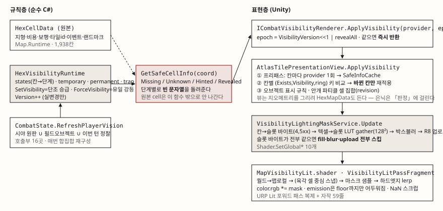</p>

이 시스템은 「안 보이는 칸을 검게 칠하기」가 아니라 **「모르는 정보를 건네지 않기」**로 설계돼 있습니다. 규칙층 `HexVisibilityRuntime`은 칸마다 `Unknown` · `Hinted` · `Revealed` 세 단계를 들고, 소비자에게는 `GetSafeCellInfo`가 단계별로 걸러진 구조체만 돌려줍니다. `Hinted`는 「지나갈 수 있는 땅인가」(지형 · 보행 · 높이)까지만 답하고 「거기 무엇이 있는가」(타일 정의 · 이벤트 · 랜드마크)는 빈 문자열입니다. 툴팁 · 미니맵 · HUD · 오브젝트 표시 판정이 이 구조체를 읽으므로, 새 UI를 만드는 사람이 실수로 원본을 노출하는 길이 좁습니다.

상태 집합은 넷이 역할을 나눕니다. `states`만 세이브 대상이고, `temporaryRevealed`는 「다음에 강등할 후보」, `permanentlyRevealed`는 「강등 면제」(보스 아레나), `trapRevealed`는 단계와 직교하는 함정 발견입니다. 승급은 「현재 ≥ 요청이면 무시」하는 단조 경로 하나로만, 강등은 private 경로 하나로만 일어나고, enum 선언 순서가 비교 연산의 계약입니다. 임시 공개는 차감이 아니라 **합집합 재구성**입니다. 매 갱신마다 세 소스(시야 · 정찰 · 필드 오브젝트)의 합집합을 새로 만들어 넘기고, 런타임은 「집합에 없는 기존 임시 칸」만 `Hinted`로 내립니다. 필드 오브젝트가 만료됐는데 그 칸이 시야 안이면 그대로 `Revealed`이고, 소스끼리 서로를 지울 수 없습니다.

<p align="center">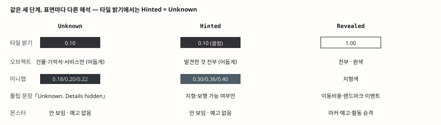</p>

### 셰이더 — 무엇이 자작이고 무엇이 복제인가

출하 표현은 LightingMask 모드입니다. 규칙층의 단계가 마스크 텍스처로 구워지고, 타일 셰이더 `MapVisibilityLit`이 월드 공간에서 그 마스크를 샘플해 URP PBR 결과에 곱합니다. 이 셰이더는 URP `Lit.shader`의 프로퍼티 · pragma · 패스를 복제하고 프래그먼트만 바꾼 **변형**입니다. 자작은 마스크 샘플 · 육각 스냅 함수 · 하드엣지 · emission floor · NaN 스크럽이고, 그림자 · 깊이 · 메타 패스는 `UsePass`로 URP 것을 재사용합니다.

<p align="center">
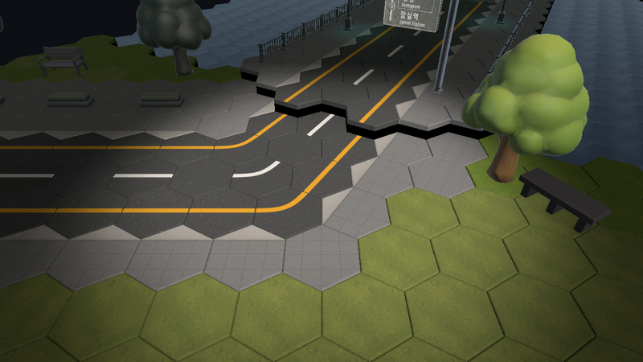

</p>
<p align="center"><sub>왼쪽 LightingMask(출하) · 오른쪽 OverlayTint(원형). 같은 장면, 두 렌더.</sub></p>
<p align="center">
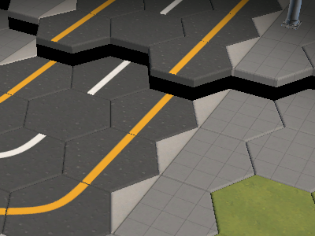
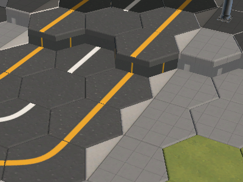
</p>
<p align="center"><sub>경계 확대. 왼쪽은 연속으로 어두워져 경계가 어느 칸에 걸쳤는지 읽기 어렵고(「또렷하게」 요구가 두 번 나온 자리), 오른쪽은 칸 단위로 끊어지지만 안개보다 색칠로 읽힌다.</sub></p>

### 이 시스템에서 중점을 둔 것

**은닉의 단일 지점.** 규칙층 최초 체인지셋이 cs:29(2026-05-17)로 이 코드베이스에서 가장 오래된 시스템 중 하나인데, 원본 셀이 함수 밖으로 나가지 않는 구조는 그때부터 지금까지 같습니다. 그리고 **「안 만들기로 한 결정」을 계약으로 확정한 것.** 시야 차폐(line-of-sight)는 저작 데이터 `blocksVision`이 649개 깔려 있고 조회 API까지 완성돼 있었지만 읽어서 판단하는 소비자가 하나도 없었습니다. 구현하는 대신 「시야는 순수 거리」를 계약으로 확정하고 테스트로 잠갔으며(DEC-2026-07-28-03), 죽은 조회 API는 지우고 저작 데이터는 직렬화 마이그레이션을 피하려 남기되 「시야에 쓰이지 않음」을 주석으로 명시했습니다.

### 코드

`Source/Map/Runtime/HexVisibilityRuntime.cs` — 은닉의 단일 지점. `Hinted`는 지형 · 보행 정보만 채우고 정체는 빈 문자열입니다.

```csharp
        public HexVisibilitySafeCellInfo GetSafeCellInfo(HexCoord coord)
        {
            if (!Map.TryGetCell(coord, out var cell))
            {
                return HexVisibilitySafeCellInfo.Missing(coord);
            }

            var visibility = GetVisibility(coord);
            if (visibility == HexCellVisibility.Unknown)
            {
                return HexVisibilitySafeCellInfo.Unknown(coord);
            }

            var isTrapRevealed = trapRevealed.Contains(coord);
            if (visibility == HexCellVisibility.Hinted)
            {
                return new HexVisibilitySafeCellInfo(
                    coord,
                    visibility,
                    true,
                    true,
                    false,
                    string.Empty,
                    cell.TerrainTypeId,
                    cell.BaseMoveCost,
                    cell.BaseWalkable,
                    cell.BaseBlocksVision,
                    string.Empty,
                    string.Empty,
                    cell.VisualFloor,
                    isTrapRevealed);
            }
```

`Source/Shaders/MapVisibilityLit.shader` — NaN 스크럽. 비교문 가드는 컴파일러가 no-NaN 가정으로 접어 버리지만 `max(NaN, 0) = 0`은 규격상 보장돼 접히지 않습니다. 블룸이 한 텍셀의 Inf를 화면 전체로 번지게 했던 실사고의 기록입니다.

```hlsl
                //
                // Scrub via hardware min/max rather than a comparison test: the shader compiler assumes
                // no-NaN and folds "(x >= 0 || x < 0)" to a constant true, defeating a comparison-based
                // guard, whereas min/max are spec-defined to return the non-NaN operand (so max(NaN,0)=0)
                // and cannot be folded away. max flushes NaN and negatives to 0; min caps +Inf and any
                // pathological magnitude at a generous ceiling that still preserves real bright/bloom
                // sources.
                color.rgb = max(color.rgb, half3(0.0h, 0.0h, 0.0h));
                color.rgb = min(color.rgb, half3(64.0h, 64.0h, 64.0h));
```

### 트레이드오프 · 남은 문제

- **차폐를 안 만든 이유 셋 중 하나는 약합니다.** 기각 이유는 (a) 밸런스 급변(건물 649개가 깔린 도심 맵에서 보이는 칸 급감) (b) 몬스터 감지와의 비대칭(「나는 건물 뒤를 못 보는데 몬스터는 나를 본다」) (c) 핫패스 비용입니다. (a)와 (b)는 게임 규칙의 문제라 무겁고, (c)는 측정 없이 적힌 것이라 가볍습니다. 「성능이 이유였다」고는 말할 수 없습니다.
- **육각 셀 스냅은 채택 뒤 되돌려졌습니다.** 「경계를 또렷하게」 요구로 육각 스냅 + 그라데이션 + 블러 조합을 채택했다가(DEC-2026-08-20-03), 마스크 해상도가 헥스당 텍셀 2~3개뿐이라 스냅이 당길 원본이 이미 이웃 평균이라는 실측으로 cs:1212에서 되돌렸습니다. 채택은 결정 로그에 있고 되돌림은 체인지셋 코멘트에만 있습니다.
- **타일에서 `Hinted`와 `Unknown`이 같은 밝기입니다.** 세 단계 모델이 타일 표면에서는 두 단계로 보이고, 세 번째 단계는 오브젝트(발견한 것이 남음)와 미니맵(색)에서만 드러납니다. 「둘을 가르는 시도는 되돌려졌다」는 기록만 있고 이유는 없습니다.
- **은닉이 막지 못하는 표면.** 타일 뷰는 지오메트리를 그리려 원본 `HexMapData`를 듭니다. 「소비자가 필터를 우회할 방법이 아예 없다」는 과장이고, 은닉이 실제로 막는 것은 툴팁 · 미니맵 · HUD · 오브젝트 판정입니다.
- **스펙 드리프트.** 「발견한 함정이 재개 시 사라진다」 「시야 범위를 바꿀 수단이 없다」는 두 갭이 코드에서는 닫혔는데 스펙은 2026-07-28 이후 갱신되지 않았습니다.

> 근거 · DEC-2026-07-28-03 · `Source/Map/Runtime/HexVisibilityRuntime.cs` · `Source/Shaders/MapVisibilityLit.shader` 주석 · `Source/Map/Unity/VisibilityLightingMaskService.cs` · `Tests/EditMode/Map/Runtime/HexVisibilityRuntimeTests.cs` · 되돌림 cs:1212 체인지셋 코멘트

<br>

## 7. 연출 타임라인

<p align="center">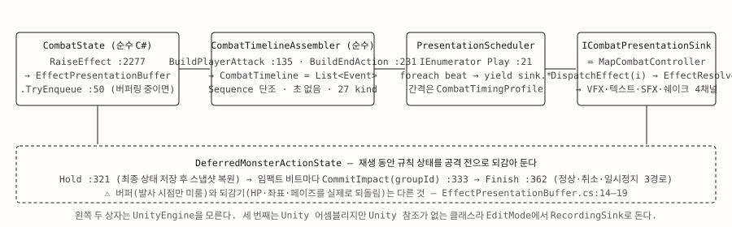</p>

규칙층이 효과를 버퍼에 쌓으면 어셈블러가 **초(秒)가 없는 비트 목록**으로 굳히고, 스케줄러가 그것을 코루틴으로 한 비트씩 재생합니다. 규칙이 연출에 「알리는」 방식은 이벤트 하나(효과 1건의 발사)와 자료구조 하나(`CombatTimeline`, 발사 순서와 간격)의 조합입니다. 비트 종류는 27개(이동 스텝 · 공격 시작 · 타격 순간 · 개별 효과 · 피격 · 사망 · 히트스톱 · 스포트라이트 · 보스 기믹 …)이고, 「그룹」은 트랙이 아니라 `owner:action:seq` 형식의 문자열 라벨입니다. 타격 비트와 그 효과들이 같은 라벨을 가져 스케줄러가 한 비트에서 함께 처리하고, 규칙은 이 값을 읽지 않습니다.

`CombatTimeline`은 순수 C# 규칙층에 살 수 있도록 의미상의 비트만 담고 초는 담지 않습니다. 초는 두 출처에서 붙습니다. 이동 · 스태거는 스케줄러가 전역 타이밍 프로파일에서 직접 읽고, 공격형(wind-up · impact · hit-stop)은 비트의 `TimingKey`만 넘겨 sink가 길이를 정합니다. 그래서 공격별 타이밍 테이블을 스케줄러가 몰라도 존중됩니다. 스케줄러의 머리 주석은 이 큐가 해결한 문제를 이름 붙여 두었습니다. 「모든 것이 한 프레임에」 겹치던 것을, 이동은 한 칸씩, 효과는 프로파일이 정한 간격만큼 벌려 내보내 SFX · VFX · 피해 숫자가 하나씩 읽히게 한 것입니다.

### 재생 동안 규칙은 되감겨 있다

규칙은 화면보다 먼저 끝납니다. 그래서 몬스터 행동을 재생하는 동안 규칙 상태(HP · 방어도 · 좌표 · 페이즈 · 상태이상)는 **공격 전으로 되감겨** 있다가, 타격 비트마다 그 시점의 스냅샷으로 커밋되고, 재생이 끝나면 최종 상태로 확정됩니다. 화면이 「아직 안 맞았다」고 보여주는 동안 HUD가 이미 깎인 HP를 보이지 않게 하기 위한 두 번째 상태입니다.

<p align="center">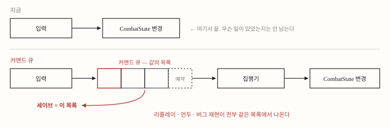</p>

### 이 시스템에서 중점을 둔 것

**순서를 정하는 두 클래스에 엔진 참조가 없는 것.** 어셈블러는 `Combat.Runtime` 안에 있고 스케줄러는 Unity 어셈블리에 있지만 파일 안에 UnityEngine using이 없습니다. 그래서 어셈블러 58건 · 스케줄러 15건 · 타임라인 5건의 테스트가 Unity 없이 돌고, 스케줄러 테스트는 기록용 가짜 sink의 로그 순서를 잽니다. 「반응 섬광이 피해 숫자보다 먼저 나온다」 같은 순서 계약이 테스트에 잠겨 있고, 어셈블러 주석은 리팩토링 중 체감을 바꾸지 않으려 그 순서를 보존했다고 적고 있습니다.

### 코드

`Source/Combat/Unity/Presentation/PresentationScheduler.cs` — 재생 루프의 머리. 비트마다 sink를 `yield`합니다.

```csharp
        public IEnumerator Play(CombatTimeline timeline, CombatTimingProfile timing, ICombatPresentationSink sink)
        {
            if (timeline == null || timing == null || sink == null)
            {
                yield break;
            }

            foreach (var beat in timeline.Events)
            {
                // Stamped before the beat runs, so a beat's timestamp is when it started rather than when its
                // wait finished — that is what makes the gap to each channel's landing readable.
                CombatPresentationTrace.Record(CombatTraceChannel.Beat, beat.Kind.ToString(), DescribeBeat(beat));

                switch (beat.Kind)
                {
                    case CombatTimelineEventKind.PlayerMoveStep:
                        yield return sink.MovePlayerStep(beat.From.Value, beat.To.Value, timing.ScaleDuration(timing.PlayerMoveSeconds));
                        break;
```

`Source/Combat/Runtime/CombatState.cs` — 되감기. 최종 상태를 잡아 둔 뒤 초기 스냅샷으로 되돌립니다.

```csharp
        public void HoldDeferredMonsterActionStateUntilPresentation()
        {
            var deferred = deferredMonsterActionState;
            if (deferred == null)
            {
                return;
            }

            deferred.CaptureFinal(Player.Hp, Player.Block, PlayerCoord, Phase, activeEffects.All);
            RestoreDeferredMonsterActionSnapshot(deferred.Initial);
        }
```

### 트레이드오프 · 남은 문제

- **되감기가 낳은 사고.** 되감긴 창 안에서 저장하면 이미 해결된 몬스터 공격이 환불된 세이브가 남습니다(2026-08-31 실증, 5피해 소실). 수정은 저장 직전에 지연 상태를 확정하는 것이었지만, 그 확정이 「죽은 플레이어」를 담을 수 있어 호출부가 별도 술어로 중단 저장 자체를 걸러야 하는 계약이 하나 더 생겼습니다. 규칙층 내부 사정이 호출부로 샌 형태입니다. 버퍼(발사 시점만 미룸)와 되감기(실제로 상태를 되돌림)가 한 묶음으로 취급돼 온 것도 같은 조사에서 확인됐습니다.
- **동기 실행 모델의 비용.** 이 프로젝트는 규칙 함수가 한 호출에서 끝까지 도는 동기 모델이고, 연출은 그 결과에서 파생됩니다. Slay the Spire식 액션 큐(규칙을 액션 객체로 큐에 넣고 프레임에 걸쳐 실행)였다면 되감기 · 예약 슬롯(3절) · 유물 훅 산재가 사라지지만, EditMode 테스트 약 2,500건의 전제(「규칙 = 함수 호출 한 번」) · 「예고 수치 = 실제 피해」 보장 · 시드 커서 저장(9절)이 전부 동기 소비 순서 위에 서 있어 전환 규모가 규칙 코어 재작성에 가깝습니다. 2026-09-06 판단은 「큐가 더 적합해 보이지만 지금은 시간이 부족하다」이고, 전환 없이 흡수하는 대안(예약을 목록으로 · 트리거를 구독으로 · 되감기 창을 테스트로 잠금)을 별도 트랙으로 적어 두었습니다.
- **이 구조의 「왜」는 기록에 없습니다.** 결정 로그의 타임라인 · 스케줄러 항목은 전부 이 구조를 이미 있는 것으로 전제한 기능 결정이고, 「모든 것이 한 프레임에」를 언제 어떤 화면에서 봤는지는 스케줄러 주석에만 있습니다.
- **공격별 타이밍 테이블은 사실상 비어 있습니다.** 3계층(전역 프로파일 → 공격별 테이블 → 큐별 지연) 중 둘째가 1행 공란이고, 실질 저작은 셋째에서 일어납니다. 유지할지 걷어낼지 정하지 않았습니다.

> 근거 · `Source/Combat/Runtime/Timeline/CombatTimeline.cs` 머리 주석 · `Source/Combat/Unity/Presentation/PresentationScheduler.cs` · `Source/Combat/Runtime/DeferredMonsterActionState.cs` · `Source/Combat/Runtime/CombatState.Suspend.cs` 주석 · `Tests/EditMode/Combat/CombatTimelineAssemblerTests.cs` · 실행 모델 비교 2026-09-06

<br>

## 8. 카드와 덱 두 벌

<p align="center">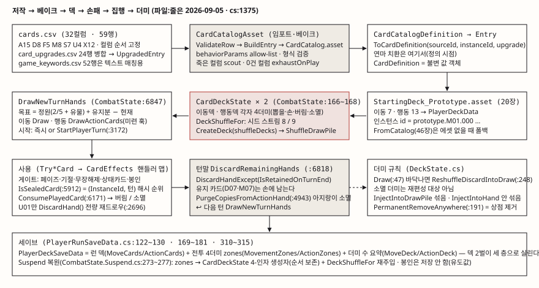</p>

플레이어는 덱을 **두 벌** 듭니다. 이동 덱과 행동 덱은 각각 독립된 4더미(뽑을 더미 · 손 · 버림 · 소멸) 기계 `DeckState`이고, 손 정원도 둘로 나뉘며(출하 2 · 5), 유물이 손 크기를 늘릴 때도 어느 덱을 가리키는지 저작으로 정합니다. 이동이 카드라는 것이 Slay the Spire와 가장 다른 점이고, 「덱 오염」의 체감이 그만큼 큽니다. 두 덱의 셔플은 서로 다른 시드 스트림(8 · 9)을 씁니다. 한쪽의 재셔플 횟수가 다른 쪽의 순서를 밀면 카드 한 장 추가가 판 전체를 바꾸기 때문입니다.

턴 경계에서는 유지 카드만 남기고 전량 버린 뒤(`DiscardRemainingHands`), 16단계가 끝난 뒤에야 새로 뽑습니다(`DrawNewTurnHands`). 버림과 뽑기 사이에 턴 경계가 끼어 있어, 손패를 바꾸는 효과(유물 · 저주)가 드로우 전에 반영됩니다.

<p align="center">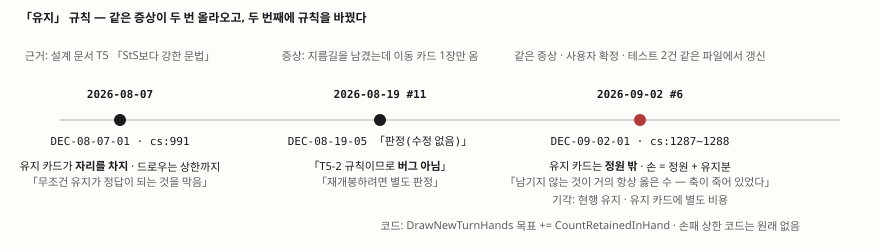</p>

### 유지 규칙 — 세 번 판단하고 한 번 뒤집었다

「유지 카드를 남기면 다음 턴 손이 몇 장인가」는 이 시스템에서 사용자 판단이 가장 두껍게 남은 자리입니다. 2026-08-07 「유지 카드는 정원을 차지한다」로 확정(DEC-2026-08-07-01), 08-19 실플레이에서 같은 증상이 제기됐을 때 「규칙이지 버그가 아니다」로 무혐의, 09-02 두 라운드 연속 제기를 「규칙이 안 읽힌다는 증거」로 보고 **뒤집었습니다**(DEC-2026-09-02-01). 지금은 유지 카드가 정원 밖이라 다음 턴 손이 「정원 + 유지분」입니다. 그래야 「남긴다」가 손해가 아니라 선택이 됩니다. 코드 변경은 함수 하나 신설과 두 줄이었고, 옛 규칙을 단언하던 테스트를 새 파일이 아니라 같은 파일에서 갱신했습니다. 새 파일이면 옛 규칙 시험이 남기 때문입니다.

### 봉인 — 적이 내 손패를 잠근다

봉인은 적의 공격이 덱 품질을 때리는 이 게임 고유의 채널입니다. 어느 카드가 잠기는지는 저장하지 않고 **카드 인스턴스 id와 턴 번호의 결정적 해시**로 매 턴 유도합니다. 옛 해시는 id를 다 흡수한 뒤 턴을 XOR해 한 번 곱하는 구조였는데, 작은 턴 번호는 하위 비트만 건드려 곱 한 번으로는 순위를 뒤집지 못했습니다. 손패 6장이 고정일 때 37%가 10턴 내내 같은 카드를 잠갔고(파이썬 이식으로 재현), 「매 턴 재선정」이라는 규칙이 지켜지지 않고 있었습니다. 테스트는 초록이었습니다. 재선정이 아니라 다른 것을 재고 있었기 때문입니다. 새 해시는 턴을 먼저 흩어 FNV 시작값에 넣고 murmur3 fmix32로 끝내, 같은 실험에서 10턴 내내 같은 카드가 0%입니다.

### 이 시스템에서 중점을 둔 것

**규칙의 채택과 기각을 기록으로 남기는 것.** 두 벌 · 4더미 · 임포터 구조는 기록 없는 초기 구조입니다. 그 위의 문법은 다릅니다. 유지 채택, 개전(innate) 기각, 방전 기각, 「저주 = 카드」 전환(유물형 폐기), 이동 손패 3 → 2, 연마 명칭과 1회 상한 — 각각 결정 번호와 기각 대안이 있습니다.

### 코드

`Source/Combat/Runtime/CombatState.cs` — 턴 시작 드로우. 목표를 「정원 + 유지분」으로 잡아 유지가 없으면 예전과 같은 수를 뽑습니다.

```csharp
        private void DrawNewTurnHands()
        {
            // 유지 카드는 정원 밖이다(2026-09-02 #6 규칙 변경) — 목표를 「정원 + 유지분」으로 올려
            // 잡으므로, 유지가 없으면 예전과 정확히 같은 수를 뽑는다.
            MovementDeck.Draw(Math.Max(0,
                GetEffectiveMovementHandSize() + CountRetainedInHand(MovementDeck) - MovementDeck.HandCount));
            DrawActionCards(Math.Max(0,
                GetEffectiveActionHandSize() + CountRetainedInHand(ActionDeck) - ActionDeck.HandCount));
            // 🔴페이즈 전이 훑기만으로는 새 손패를 놓친다 — 턴 시작 드로우는 PlayerMovement로 넘어간
            // <b>뒤에</b> 일어나므로, 이동 페이즈에서 뽑자마자 쓴 카드는 다음 훑기 때 이미 손에 없다.
            SweepCodexSightings();
            PlayerHandsDrawn?.Invoke();
        }
```

`Source/Combat/Runtime/CombatState.cs` — 봉인 해시.

```csharp
        private static int StableSealHash(string instanceId, int turn)
        {
            unchecked
            {
                // 턴을 먼저 흩어 놓아야 뒤따르는 id 흡수가 턴마다 다른 궤적을 그린다.
                var hash = (int)(2166136261u ^ (uint)turn * 2654435761u);
                hash *= 16777619;

                var id = instanceId ?? string.Empty;
                for (var i = 0; i < id.Length; i++)
                {
                    hash = (hash ^ id[i]) * 16777619;
                }

                // 최종 아발란치(murmur3 fmix32) — 상위 비트까지 고루 섞어 근접한 두 해시가
                // 턴이 바뀌면 실제로 자리를 바꾸게 한다.
                var mixed = (uint)hash;
                mixed ^= mixed >> 16;
                mixed *= 2246822507u;
                mixed ^= mixed >> 13;
                mixed *= 3266489909u;
                mixed ^= mixed >> 16;
                return (int)(mixed & 0x7fffffff);
            }
        }
```

### 트레이드오프 · 남은 문제

- **소멸이 4경로입니다.** 카드가 소멸 더미로 가는 길이 넷(카드별 핸들러 · 임시 카드 턴말 정리 · 선택 카드 비용 · `exhaustOnPlay` 컬럼)이고, 넷째 컬럼은 소비자와 테스트가 있는데 저작이 0/59입니다. 통일하지 않은 이유는 기록에 없습니다.
- **로직이 CSV 토큰 컬럼에 밀려 들어가 있습니다.** `behaviorParams` · `postActions` · `choiceOptions` 같은 `키:값;키:값` 문법이 CSV 32컬럼을 복잡하게 만든 원인의 절반이고, 새 규칙 하나가 핸들러 · 허용 목록 · CSV · VFX 큐 · 키워드 문안 다섯 곳을 건드립니다. 1인 개발이라 데이터 주도의 핵심 이점(비개발자 협업)이 없다는 판단으로 **카드당 C# 클래스 하나**로 옮기는 트랙이 진행 중입니다(P1 완료, cs:1386~1388). 이 리포의 `Source/Combat/Runtime/Cards/`가 그 결과이고, StS의 실행 모델(카드가 연출 액션을 직접 큐에 넣는 것)은 가져오지 않습니다.
- **주입은 뽑을 더미를 통째로 다시 섞습니다.** 몬스터가 저주 한 장을 넣으면 그 덱의 남은 순서가 전부 바뀝니다. 뽑을 더미를 미리 보는 효과가 없어 플레이어가 차이를 알 길은 없고, 무작위 위치 삽입 대안이 검토된 기록은 없습니다.
- **두 벌로 나눈 「왜」는 기록이 없습니다.** 코드 첫 등장(cs:42, 2026-05-25)이 결정 로그 시작(07-02) 전입니다.

> 근거 · DEC-2026-08-07-01 · DEC-2026-09-02-01 · `Source/Combat/Runtime/CombatState.cs`(`DrawNewTurnHands` · `StableSealHash` 주석) · `Source/CardCore/Runtime/DeckState.cs` · `Tests/EditMode/Combat/StatusCardAndSealTests.cs` · `Tests/EditMode/Combat/CardRetainOnTurnEndTests.cs` · 봉인 해시 재현 2026-09-05 · 클래스 전환 트랙 2026-09-06

<br>

## 9. 세이브와 재현성

<p align="center">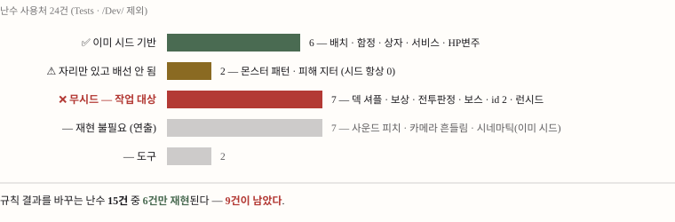</p>

세이브 설계는 코드 주석 한 문장에 적혀 있습니다. **전체 스냅샷 + 서스펜드. 난수 내부 상태는 저장하지 않고, 몬스터 예고는 저장하지 않고 재유도한다.** 난수를 안 저장하는데 재유도가 성립하는 이유는 굴린 결과를 상태에 저장하기 때문입니다. 몬스터가 고른 패턴 인덱스, 굴린 피해 변주값, 빠른거북이 뽑은 값이 스냅샷에 실립니다. 세이브 결정성에는 두 전략이 있습니다. A는 난수 스트림을 재현하는 것, B는 굴린 결과를 상태로 저장하는 것. 이 프로젝트는 배치 랜덤화에 A, 전투에 B를 씁니다. B는 밸런스 패치에 강합니다. 결과가 이미 확정돼 있으니 CSV를 고쳐도 안 흔들립니다. 「읽기 시점 재굴림은 배지가 거짓말을 하게 만든다」는 판단(DEC-2026-08-19-02)의 부산물입니다.

그러니까 세이브 복원 정확성은 B로 이미 풀려 있었습니다. 시드화 트랙이 필요했던 이유는 세이브가 아니라 **재현성**입니다. 로그라이크의 시드 공유는 장르 관습이고 버그 재현의 1차 수단인데, 2026-09-05 조사 시점에 난수 24곳 중 7곳이 무시드였습니다. 덱 셔플(Guid 해시), 보상 · 상점(전역 상태인 `UnityEngine.Random`이라 연출이 굴리면 밀림), 전투 판정 여섯 가지가 묶인 인스턴스, 카드 인스턴스 id(봉인 테스트 간헐 실패의 원인) 등입니다. 코드는 스스로 알고 있었습니다. 「전투 RNG는 이미 네 인스턴스에 흩어져 있어 다섯 번째를 더하면 시드 재현이 더 멀어진다」는 주석이 남아 있습니다.

<p align="center">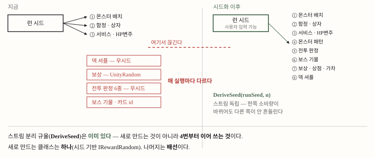</p>

### 시드 스트림 — 번호표 하나, 파생 하나

배치 랜덤화는 이미 시드 기반이었고 스트림 분리까지 돼 있었습니다. 시드화 트랙은 그 계보를 전투 · 보상 · 덱까지 잇는 일이었지 새 구조를 만드는 일이 아니었습니다. 런 시드 하나를 스트림 번호표 `RunSeedStreams`로 갈라, 한 소비자의 굴림 횟수가 바뀌어도(밸런스 패치 · 카드 추가) 다른 소비자의 결과가 밀리지 않게 합니다. 번호표는 append-only입니다. 기존 번호를 바꾸면 그 시드로 이미 공유된 판이 달라집니다. 몬스터 배치는 파생 없이 원시 시드를 그대로 쓰는데, 트랙 착수 전부터 그랬고 바꾸면 기존 시드의 배치가 달라져 둡니다.

P5에서 「같은 시드 → 같은 판」이 **저장 지점을 넘게** 했습니다. `System.Random`은 내부 상태를 내주지 않으므로, 대신 「몇 칸 썼는가」를 세는 `CountingRandom`으로 일곱 인스턴스를 바꾸고 스냅샷에 커서 정수를 실어 재개 시 같은 시드로 새로 만들어 그만큼 버립니다. `Random` 파생이라 호출 자리 22곳을 한 줄도 안 고쳤습니다. 이 결정은 「재현성은 저장 지점까지」라고 계약에 적는 안을 사용자가 기각한 결과입니다. 「같은 시드면 다시 시작해도 같은 판이어야 한다.」

### 이 시스템에서 중점을 둔 것

**세이브 전략과 재현성 전략을 갈라서 보는 것.** 두 목적을 섞으면 「세이브가 고장났다」는 진단이 나오지만, 세이브는 B로 정확했고 부족한 것은 재현성이었습니다. 그리고 **연출 난수는 재현하지 않는다**는 경계. 카메라가 흔들리는 각도가 달라도 같은 판입니다. 규칙 결과를 바꾸는 난수만 시드화합니다.

### 코드

`Source/Map/Runtime/RunSeedStreams.cs` — 스트림 번호표.

```csharp
    public static class RunSeedStreams
    {
        /// <summary>몬스터 슬롯 셔플·풀 추첨. 파생 없이 원시 시드(번호는 문서용).</summary>
        public const int MonsterPlacement = 0;
        /// <summary>함정 슬롯 승격·프리셋 치환.</summary>
        public const int Traps = 1;
        /// <summary>상자 좌표 셔플.</summary>
        public const int Chests = 2;
        /// <summary>서비스 오브젝트(잡화점·캠핑카) 배치.</summary>
        public const int Services = 3;
        /// <summary>스폰 시 체력 변주(hpVariancePct). 3을 공유하되 spawnRefId로 재혼합.</summary>
        public const int SpawnHpVariance = 3;
        /// <summary>몬스터 공격 패턴 선택 + 피해 변주(<c>MonsterAiPlanner</c>).</summary>
        public const int MonsterAttackPattern = 4;
        /// <summary>전투 판정(<c>CombatState.pushRng</c>): 취약 부위·빠른 거북·순간이동지·전염 대상·되돌릴 부적·제거될 카드.</summary>
        public const int CombatJudgement = 5;
        /// <summary>보스 기물 볼리의 링 회전각.</summary>
        public const int BossProps = 6;
        /// <summary>보상·상점·뽑기·전리품(<c>IRewardRandom</c>).</summary>
        public const int Rewards = 7;
        /// <summary>이동덱 셔플. 행동덱과 갈라 둔다 — 한쪽 소비량이 다른 쪽을 밀면 안 된다.</summary>
        public const int MovementDeckShuffle = 8;
        /// <summary>행동덱 셔플.</summary>
        public const int ActionDeckShuffle = 9;

        /// <summary>런 시드에서 <paramref name="stream"/>번 스트림의 시드를 뽑는다.</summary>
        public static int Derive(int runSeed, int stream)
        {
            return PlacementRandomizer.DeriveSeed(runSeed, stream);
        }
    }
```

### 트레이드오프 · 남은 문제

- **버전 간 재현성은 없습니다.** 시드는 코드 + 데이터 버전이 고정될 때만 판을 고정합니다. 반복 감쇠 도입(10절)처럼 규칙이 바뀌면 같은 시드가 다른 판을 내고, 세이브에는 시드만 실리고 버전은 안 실립니다. 진행 중인 세이브의 맵이 재개 시 달라질 수 있다고 코드가 스스로 적어 두었습니다. 전투 쪽이 B 전략(결과 저장)을 쓰는 것이 이 위험을 줄입니다.
- **커맨드 큐는 하지 않기로 했습니다.** 시드 재현은 「세계」(맵 · 적 · 보상 후보 · 덱 순서)를 고정하고, 플레이 재현은 「역사」(그 사람이 겪은 그 판)를 고정합니다. 로그라이크의 시드 공유는 전자이고, 후자의 표면(상점 구매 · 보상 선택 · 유물 발동)은 표현 계층에 흩어져 있어 훨씬 넓습니다. 순서는 시드화 → 커맨드 큐이지 그 반대가 아닙니다. 커맨드 큐는 결정성을 만들어 주지 않습니다.
- **되감기 창 문제는 시드화로 안 없어집니다.** 7절의 사고는 상태 저장 특유의 병이고, 지금은 저장 직전 확정 + 호출부 술어로 막고 있습니다.
- **결정성 게이트는 새로 만들어야 했습니다.** 기존 저장 왕복 감사 툴은 직렬화 필드 누락만 보고 「같은 시드 → 같은 결과」는 보지 않았습니다. 새 테스트는 3절의 원칙대로 「같은 순서로 굴렸는가」가 아니라 「뽑힌 카드가 같은가」로 단언합니다.
- **미커버 축.** 플로우 계층의 보상 커서 봉투 작성은 씬 의존이라 EditMode 테스트가 덮지 못합니다.

> 근거 · DEC-2026-08-19-02 · `Source/Combat/Runtime/CombatState.Suspend.cs` 머리 주석 · `Source/Map/Runtime/RunSeedStreams.cs` · `Source/CardCore/Runtime/CountingRandom.cs` · `Source/Combat/Runtime/CombatState.RngCursors.cs` · `Tests/EditMode/Combat/RunSeedDeterminismTests.cs` · 시드 트랙 P1~P5 2026-09-05(cs:1359 · cs:1380)

<br>

## 10. 배치 랜덤화

<p align="center">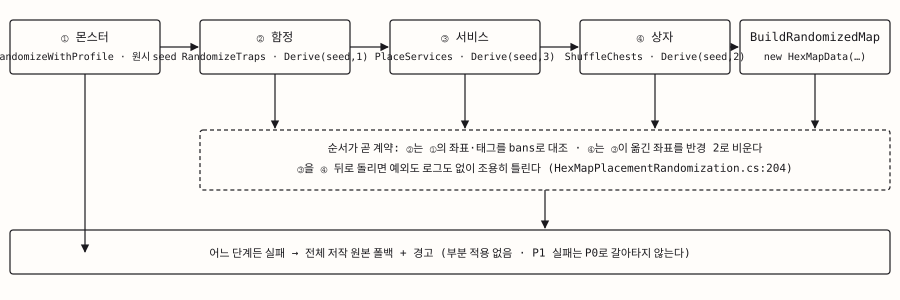</p>

지형은 손으로 그린 그대로 두고 **몬스터 · 함정 · 상자 · 서비스 오브젝트만 시드로 달라지는** 판입니다. 랜덤화는 전투 진입 경로 한 곳에서만 걸리고, 룩뎁 · 타일 프리뷰 · 에디터 검증은 저작 원본을 그대로 씁니다. 네 단계가 순서대로 돌고, 어느 단계든 검증 게이트에 걸리면 스테이지 단위로 다시 뽑으며, 재롤 상한을 넘기면 저작 원본으로 폴백합니다.

핵심 문법은 **슬롯 승격**입니다. 맵 저작자가 태그를 붙인 칸이 슬롯이고, 「태그 있음 + 내용 비어 있음」이 예비 슬롯입니다. 저작 원본 빌드는 예비 슬롯을 건너뛰므로 프리뷰 · off · 폴백 경로에는 안 나타나고, 랜덤화가 켜지면 점유 슬롯과 예비 슬롯을 합친 후보에서 그룹당 스폰 수(밀도 앵커)만큼 비복원 추첨합니다. 무엇을 뽑을지는 CSV 풀(그룹별 가중치 · 지대 하한 · 상한 · 위협 비용)이 정합니다. 새 enum 값은 없고 `randomizationGroup` 문자열 필드 하나라, 저작 표면이 늘어도 코드는 그대로입니다.

<p align="center">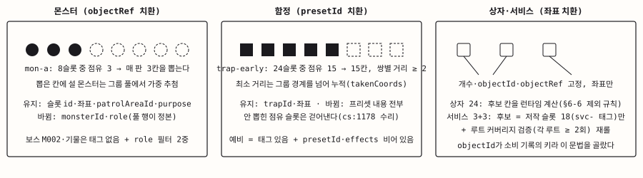</p>

### 검증 게이트와 반복 감쇠

한 시도가 끝나면 안전 반경(플레이어 스폰에서 직선 거리) · 위협 합 창 · 정예 하한 · 정예 쌍별 거리 · 종 하한 · 밀도(어느 칸 기준이든 반경 2 위협 합 상한)를 차례로 봅니다. 여섯 중 하나라도 실패하면 스테이지 단위로 다시 뽑습니다. 이 손잡이들은 코드 상수가 아니라 프로파일 CSV에 있습니다. 「난이도 손잡이는 코드 상수가 아니라 프로파일」이 실플레이 피드백을 집행하며 세운 원칙입니다.

**반복 감쇠**는 저작 표를 한 줄도 안 고치고 넣은 손잡이입니다. 실플레이에서 「초반엔 삼목구, 중반엔 사자탈과 황소만」이 제기됐을 때, 종전 추첨이 복원추출이고 상한은 맵 전체 기준이라 밴드 안 다양성은 아무도 안 보고 있었다는 진단이 나왔습니다. 해법은 이미 뽑힌 종의 가중치를 뽑힌 횟수만큼 절반씩 깎되 바닥 1을 두는 것입니다. 0으로 떨어뜨리면 감쇠가 상한이 되어 「몇 마리까지」를 두 곳에서 정하게 되기 때문입니다. 셈은 상한과 같은 카운터를 쓰므로 둘이 갈라질 수 없고, 정수 시프트라 시드 결정성도 그대로입니다.

### 이 시스템에서 중점을 둔 것

**「손잡이는 내가, 구조는 조사」의 경계.** 손저작 공간 + 풀 추첨 + 규칙으로 가두는 방식과 슬롯 승격형 · 결정성 · 폴백의 구조는 레퍼런스 조사에서 왔고 그 조사는 에이전트가 했습니다. 사용자 판단이 두꺼운 곳은 수치와 규칙의 추가(안전 반경 4 → 6 · 정예 하한 · 정예 거리 · 종 하한 · 함정 9벌 · 정예 배율)와 기각(함정 범위 · 잔존 유지 안 → 단칸 · 1회성, 서비스 배치 A안 → 실플레이에서 「못 만난다」로 기각)입니다. 「이 시스템을 내가 설계했다」와 「이 시스템의 손잡이를 내가 실플레이로 정했다」는 다른 문장이고, 이 README는 후자만 씁니다.

### 코드

`Source/Map/Runtime/PlacementRandomizer.cs` — 반복 감쇠 가중 추첨. 가중치 감쇠 자체는 바로 아래 `DecayedWeight`가 뽑힌 횟수만큼 시프트하되 바닥 1을 둡니다.

```csharp
        private static StageRandomizationPoolEntry WeightedPickWithRepeatDecay(
            IReadOnlyList<StageRandomizationPoolEntry> entries,
            Random rng,
            IReadOnlyDictionary<string, int> alreadyPicked)
        {
            var weights = new int[entries.Count];
            var total = 0;
            for (var index = 0; index < entries.Count; index++)
            {
                weights[index] = DecayedWeight(entries[index], alreadyPicked);
                total += weights[index];
            }

            var roll = rng.Next(total);
            for (var index = 0; index < entries.Count; index++)
            {
                roll -= weights[index];
                if (roll < 0)
                {
                    return entries[index];
                }
            }

            return entries[entries.Count - 1];
        }
```

### 트레이드오프 · 남은 문제

- **감쇠 카운터는 그룹이 아니라 맵 전체입니다.** 진입부에서 삼목구가 두 번 뽑히면 다음 밴드의 첫 슬롯에서 삼목구 가중치는 이미 1/4이고, 후반 밴드에서는 대개 바닥입니다. 「저작 표의 첫 뽑기 확률은 그대로」는 맵의 첫 슬롯에서만 참이고, 후반 밴드에서 표의 숫자는 다른 뜻이 됩니다. 1,000판 스윕 분포를 보고 사용자가 「초반 약하게 · 후반 강하게 곡선과 같은 방향」이라 현행 유지로 판정했습니다. 밸런스 변경은 실플레이 판정 뒤에만 합니다.
- **재롤을 실제로 부르는 게이트는 둘뿐입니다.** 1,000판 스윕에서 폴백은 0이고, 재롤 귀속 실험에서 예산 · 밀도 · 종 하한은 한 번도 안 물었습니다. 무는 것은 정예 하한과 정예 거리이고, 위협 합 창의 아래 절반은 안 쓰입니다. 문서는 예산 · 밀도 · 지대를 앞세우지만 실제 난이도를 정하는 손잡이는 정예 두 규칙입니다.
- **규칙이 바뀌면 같은 시드가 다른 판을 냅니다.** 감쇠 도입, 몸 화이트리스트, 예비 슬롯 신설이 전부 그 예이고, 코드 주석이 매번 「진행 중인 세이브의 맵은 재개 시 달라진다」고 적어 두었습니다(9절).
- **결정 기록이 정본 밖에 산 것이 넷.** 반복 감쇠, 함정 9벌, 몸 화이트리스트, 두 번째 스테이지 프로파일은 체인지셋 코멘트 · CSV 주석 · 코드 주석에만 있다가 2026-09-05에 결정 로그로 소급 등재됐습니다(DEC-2026-09-05-04). 결정이 없는 것이 아니라 정본 밖에 있는 문제였습니다.

> 근거 · DEC-2026-08-18-01 · DEC-2026-08-19-04 · DEC-2026-09-05-04 · `Source/Map/Runtime/PlacementRandomizer.cs` 주석 · `Source/Map/Runtime/PlacementRandomizerTrapsAndChests.cs` · `Tests/EditMode/Map/Unity/PlacementRandomizationStage1Tests.cs` · 1,000판 스윕 2026-09-05 에디터

<br>

## 11. 데이터 파이프라인

<p align="center">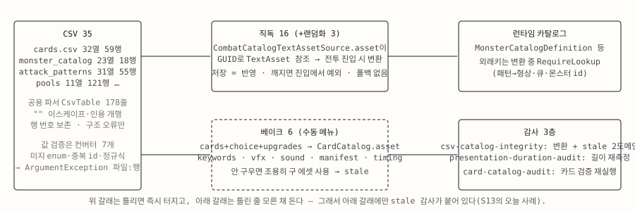</p>

밸런스는 코드가 아니라 CSV에 있습니다. 다만 런타임이 읽는 방식이 두 갈래입니다. 몬스터 · 플레이어 · 상태이상 · 유물 · 형상 등 **직독형**은 CSV를 저장하면 곧 반영되고, 깨지면 전투 진입에서 터집니다. 카드 · 키워드 · VFX 큐 · 사운드 등 **베이크형**은 사람이 에디터 메뉴를 눌러 에셋으로 구워야 하고, 안 구우면 조용히 낡습니다. 자동 임포터(`ScriptedImporter` · `AssetPostprocessor`)는 이 경로에 없습니다. 실패의 형태가 다르므로 잡는 장치도 다릅니다. 직독형은 파서가 던지고, 베이크형은 감사 툴이 소스 CSV와 구운 에셋의 내용 시그니처를 대조합니다.

이 리포는 CSV 자체를 포함하지 않습니다(출시 전 밸런스 데이터). 파서 7개(`Source/Combat/Runtime/*Csv.cs`)와 공용 `CsvTable`, 임포터(`Source/Editor/Cards/`), 감사 툴(`Source/**/Editor/AiTools/`)이 들어 있습니다.

### 틀린 저작이 조용히 기본값으로 내려앉지 않게

공용 `CsvTable`은 구조 오류(빈 파일 · 열 수 불일치 · 미종결 인용부)만 던지고, 값의 뜻은 컨버터가 각자 검증합니다. 공통 태도는 **「미지 토큰은 기본값이 아니라 예외」**입니다. enum 파싱은 대소문자까지 정확히 맞아야 통과하고, 실패하면 파일명 · 줄 번호 · 컬럼명을 담아 던집니다. 몬스터 특성 파서의 주석이 이유를 적고 있습니다. 「오타가 조용히 기본값으로 내려앉으면 저작은 했는데 아무 일도 안 일어나는 죽은 컬럼이 된다.」

이 원칙이 문서로 선 자리는 DEC-2026-07-23-03(CSV 단일 저작 표면 승격 · 폴백 폐지)입니다. 기각 대안 「폴백을 남긴 채 CSV만 읽기」의 기각 사유가 이 시스템의 실패 경험입니다. 컬럼을 비우는 순간 하드코딩 폴백이 조용히 부활해 실수를 감췄고, 한 카드가 정확히 그 상태였습니다. 이후 결정들은 두 겹을 둡니다. 보상 등급을 CSV로 내리면서 「Basic은 저작으로 열 수 없게 임포트 단계에서 거부 + 추첨기도 제외」(DEC-2026-07-28-04), 형상 인접성은 5절의 파서 가드. **게임 규칙은 저작 관례로 두지 않습니다.**

### 이 시스템에서 중점을 둔 것

**실패가 조용하지 않게 하는 것.** 직독형은 진입에서 터지고, 베이크형은 감사 툴이 stale을 보고하며, 카드 임포터는 헤더 32열의 순서까지 고정하고 `behaviorId` · 카드 id · 파라미터 키를 허용 목록으로 걸러 「그 `behaviorId`가 읽지 않는 파라미터를 저작하면 실패」합니다.

### 코드

`Source/Combat/Runtime/MonsterCatalogCsv.cs` — enum 파싱. 같은 함수가 파서 5곳에 있습니다.

```csharp
        private static T ParseEnum<T>(string value, string fileName, int lineNumber, string column) where T : struct
        {
            if (Enum.TryParse<T>(value, ignoreCase: false, out var parsed))
            {
                return parsed;
            }

            throw new ArgumentException($"{fileName}:{lineNumber} column '{column}' has unknown value '{value}'.");
        }
```

### 트레이드오프 · 남은 문제

- **빌드에서만 드러나는 결함.** 출하 카탈로그 에셋의 보스 프로필 · 페이즈 슬롯이 비어 있습니다. 에디터에서는 `#if UNITY_EDITOR` 폴백이 파일 시스템에서 CSV를 읽어 보스전이 되지만, 플레이어 빌드에서는 빈 카탈로그가 되어 보스 프로필 · 페이즈 · 기믹이 전부 사라집니다. 씬 배선 감사 · 테스트 어느 것도 이 슬롯을 보지 않습니다. 에디터에서만 플레이해 온 동안은 드러나지 않는 종류라, 플레이어 빌드를 만든 적이 있는지가 먼저 확인할 사실입니다. 슬롯 할당(에셋 1개)과 출하 데이터 테스트 1건이 집행 후보이고, 아직 고치지 않았습니다.
- **베이크는 사람 손에 걸려 있습니다.** 키워드 CSV가 바뀌었는데 에셋을 다시 굽지 않아, 규칙은 「3턴마다 · 최대 1」인데 툴팁은 「2턴마다 · 최대 2」인 상태가 출하 중이었습니다(13절에서 다시 다룹니다).
- **외래키 검사 시점이 셋입니다.** 패턴 → 형상 · VFX 큐 · 사운드 큐는 변환(전투 진입) 시, 카드 선택지 ↔ 카드는 베이크 시, 특성 → 키워드는 테스트 시에만 검사됩니다. 「CSV 간 정합을 임포터가 검증한다」고 뭉뚱그리면 셋째 부류가 빠집니다.
- **두 태도가 공존합니다.** 카드 파서는 미지 컬럼을 거부하고(닫힘), 몬스터 파서는 선택 컬럼이 없으면 기본값으로 내려앉는 하위호환을 명시합니다(열림). 그리고 읽기 경로는 `CsvTable`로 단일화됐지만 에디터의 값 재기입 경로에는 사본 파서가 넷 남아 있습니다.

> 근거 · DEC-2026-07-23-03 · DEC-2026-07-28-04 · `Source/Combat/Runtime/CsvTable.cs` · `Source/Combat/Runtime/MonsterTraitCatalogCsv.cs` 주석 · `Source/Cards/Unity/CardCatalogAsset.cs` · `Source/Combat/Unity/Editor/AiTools/Tool_CsvCatalogIntegrity.cs` · 출하 에셋 슬롯 확인 2026-09-05

<br>

## 12. 맵 에디터

<p align="center">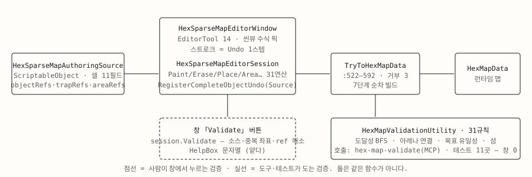</p>

저작 소스(`ScriptableObject`)를 씬뷰에서 칠하는 에디터 창 하나입니다. 도구는 enum 기준 14종이고, 정확히는 **편집 브러시 11 + 선택 툴 3**입니다. 저작 소스는 JSON이 아니라 `ScriptableObject`이고, 변환 진입점은 `TryToHexMapData` 하나라 에디터 · 전투 · 검증이 같은 함수로 같은 맵을 얻습니다. 씬뷰 픽은 1절의 런타임 피킹과 같은 원리(광선 → 평면 교차 → 축좌표 역산)를 에디터가 한 번 더 구현한 것이고 콜라이더를 쓰지 않습니다.

### 브러시 한 번 = Undo 한 스텝

마우스 다운에서 새 Undo 그룹을 열고, 드래그 중 좌표마다 세션 연산을 부르되 같은 좌표는 무시하며, 마우스 업에서 그룹을 접습니다. 기록 방식은 소스 `ScriptableObject` 전체 스냅샷이라 스트로크가 길어도 Undo 항목은 하나입니다. 저작 소스가 `ScriptableObject`인 것과 Undo 구현이 이렇게 단순한 것은 같은 선택의 양면입니다. 브러시 · 오브젝트 드래그 · 선택 드래그 3종이 같은 패턴이고, 스트로크 중에는 라이브 프리뷰를 미루고 dirty만 표시했다가 마우스 업에서 한 번 재생성합니다.

### 검증 31규칙 — 어디서 도는가

`HexMapValidationUtility`는 먼저 변환한 뒤 런타임 맵 위에서 규칙을 돕니다. 그래서 「저작 포맷이 맞는가」가 아니라 **「이 맵으로 판이 성립하는가」**를 봅니다. 중복 좌표 · 비보행 칸 스폰 · 보스 아레나 내부 보행 연결(BFS) · 시작점에서 목표까지 도달 가능성 · 고립 섬 · 팔레트 밖 지형 id 등 31규칙입니다. 10절의 랜덤화 테스트가 랜덤화 결과 맵에도 이 검증을 돌립니다.

### 이 시스템에서 중점을 둔 것

**저작자가 틀리기 어렵게 만드는 것.** 툴은 규칙층의 정확성을 보이는 자리가 아니라, 중복 좌표 거부 · 비보행 스폰 거부 · 도달성 BFS처럼 실수를 구조적으로 막는 장치를 보이는 자리입니다. 창은 IMGUI라 테스트할 수 없으므로 편집 연산 31개를 세션 클래스에 모아 그쪽을 테스트합니다.

### 코드

`Source/Editor/MapDesign/HexSparseMapEditorWindow.cs` — 스트로크 Undo 그룹핑.

```csharp
        private void BeginBrushUndoGroup()
        {
            brushStrokeUndoGroup = -1;
            if (session.Source == null || !IsUndoableSceneTool(activeTool))
            {
                return;
            }

            Undo.IncrementCurrentGroup();
            brushStrokeUndoGroup = Undo.GetCurrentGroup();
            Undo.SetCurrentGroupName(GetUndoName(activeTool));
            RegisterSourceUndo(GetUndoName(activeTool));
        }

        private void EndBrushUndoGroup()
        {
            if (brushStrokeUndoGroup >= 0)
            {
                Undo.CollapseUndoOperations(brushStrokeUndoGroup);
                brushStrokeUndoGroup = -1;
            }

            if (brushStrokeChanged)
            {
                SetDirtyAndPreview();
                brushStrokeChanged = false;
            }
        }
```

### 트레이드오프 · 남은 문제

- **창의 Validate 버튼이 31규칙을 돌지 않습니다.** 창은 더 얕은 세션 검증만 부르고, 31규칙은 MCP 툴 `hex-map-validate`와 EditMode 테스트만 돕니다. 저작자가 도달 불가 목표 · 끊어진 아레나를 창에서 알 길이 없고, 그 사실은 툴을 부르거나 테스트가 돌 때 드러납니다. 버튼이 함께 부르게 하는 것은 몇 줄이지만 아직 붙이지 않았습니다.
- **에디터가 런타임 피킹을 한 번 더 구현합니다.** 같은 원리를 두 곳이 갖고 있고, 공유 여부는 확인하지 않았습니다.
- **지형 id 마이그레이션 스캐너(632줄)가 왜 필요했는지**는 기록이 없습니다. terrain id 체계를 언제 무엇에서 무엇으로 바꿨는지 코드는 말하지 않습니다.
- **이 툴의 장치가 실플레이 버그를 실제로 막은 사례**는 확인하지 않았습니다. 체인지셋 코멘트를 뒤져야 합니다.

> 근거 · `Source/Editor/MapDesign/HexSparseMapEditorWindow.cs` · `Source/Editor/MapDesign/HexSparseMapEditorSession.cs` · `Source/Editor/MapDesign/HexMapValidationUtility.cs` · `Source/Map/Unity/Editor/AiTools/Tool_HexMapValidate.cs` · `Tests/EditMode/Map/Unity/HexSparseMapEditorSessionTests.cs` · cs:1391

<br>

## 13. 검증 인프라

<p align="center">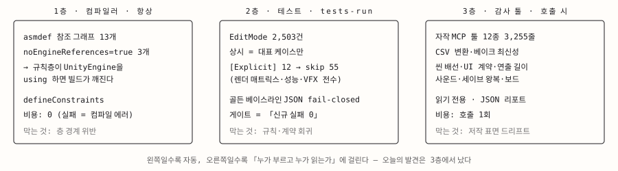</p>

세 층은 잡는 종류가 다릅니다. **1층 컴파일러**는 참조 방향 위반 · 엔진 침투 · 환경 격리를 항상, 비용 0으로 막습니다(0절). **2층 EditMode 테스트**는 규칙 회귀를 잡습니다. 이 리포의 `Tests/`에 275파일이 있고 `[Test]` 2,327 · `[TestCase]` 116 선언입니다(cs:1391). 규칙층이 순수 C#이라 씬 없이 돌고, 그것이 테스트가 빠르게 끝나는 이유입니다. **3층 자작 감사 툴 12종**은 코드가 아닌 저작물(CSV · 씬 · 에셋)의 드리프트를 봅니다. 씬 배선 누락 · CSV 정합과 베이크 최신성 · 연출 길이 stale · 세이브 왕복 · 사운드 매니페스트 대조. 전부 읽기 전용이고 JSON을 돌려주며, 12종 중 2종은 기존 유틸리티를 CLI로 노출한 래퍼입니다. 3층만 「호출 시」라 사람이 결과를 읽어야 합니다.

### 상시 게이트에는 대표 케이스만

골든 베이스라인 테스트가 이 원칙의 실물입니다. 렌더러 · 메시 필터 · 고유 메시 · 정점 · 삼각형 · 클릭 콜라이더 수를 커밋된 JSON과 **허용 오차 없는 정수 일치**로 비교합니다. 1,000셀 · 건물 25개 대표 케이스만 상시로 돌고, 전체 18케이스 매트릭스는 환경 변수를 켜야 돕니다. 베이스라인 파일이 없으면 통과가 아니라 실패, 엔트리가 없어도 실패입니다. 갱신은 `[Explicit]` 재생성 테스트로만 하고 체인지셋에 함께 싣습니다. 즉 렌더 복잡도가 바뀌면 사람이 의도적으로 베이스라인을 갱신하는 커밋을 남겨야 통과합니다. fail-closed의 정의입니다. 청크 병합이 렌더러 수를 크게 줄인다는 사실도 이 JSON 안에 숫자로 잠겨 있습니다.

### 「무는 테스트」 — 규칙 다섯 줄

2026-09-04 테스트 스위트 가치 감사에서 채택된 작성 규칙은 다섯 줄로 요약됩니다.

1. 규칙 코어 불변식은 의무. 출하 데이터는 「배선」만 잰다. 「예외 없이 변환된다」 「null 아님」 「개수 일치」는 테스트가 아니라 감사 툴 몫.
2. 저작값 핀 금지. 밸런스가 바뀌면 같이 바뀌는 숫자는 핀이지 테스트가 아니다. 「M002에 패턴 10개」 대신 「저작된 모든 패턴이 형상 라이브러리에 있다」.
3. 모든 새 테스트는 물어야 한다. 체크인 전에 코드를 한 번 깨서 빨개지는지 확인하고 체인지셋 코멘트에 적는다. 안 빨개지는 테스트는 삭제.
4. 상태는 픽스처에서만. 테스트가 `new CombatState(`를 직접 부르지 않는다.
5. 빨간 기준선을 세션 경계 너머로 넘기지 않는다. 0 실패로 끝내거나 실패 전부를 이름 · 원인과 함께 인계문에 적는다.

3번의 실물은 결정 로그 곳곳의 「돌연변이 N/N」 기록입니다. 이 README의 2절(가드 1건) · 4절(3회) · 9절(8/8) · 10절(4/4)이 그 예입니다. 다만 이 규칙은 사후에 성문화된 것이라, 그 전의 테스트 1,900여 건이 전부 이 규율로 쓰였다고는 말할 수 없습니다.

### 이 시스템에서 중점을 둔 것

**기계가 판정할 수 있는 것만 기계에 맡기는 것.** 참조 방향은 당부가 아니라 asmdef가, 성능 회귀는 사람 눈이 아니라 골든 베이스라인이, 데이터 정합은 리뷰가 아니라 감사 툴이, 문서 낡음은 기억이 아니라 체인지셋 스탬프 규칙이 잡습니다. 게이트는 총수 비교가 아니라 **「신규 실패 0」**입니다. 병렬 세션이 테스트 총수를 계속 올리기 때문에 전후 총수를 비교하면 안 됩니다.

### 코드

`Tests/EditMode/Map/Unity/MapRenderPerformanceRegressionTests.cs` — 골든 베이스라인 비교. 파일 없음도 엔트리 없음도 실패입니다.

```csharp
        private static void AssertCaseMatchesBaseline(int cellCount, int buildingCount, bool useChunks)
        {
            var document = LoadBaselineOrFail();
            var key = BaselineEntry.KeyFor(cellCount, buildingCount, useChunks);
            var expected = document.entries.SingleOrDefault(entry => entry.Key == key);
            Assert.That(expected, Is.Not.Null,
                $"No baseline entry for {key}. Run the explicit {nameof(RegenerateBaseline)} test and commit the updated baseline JSON.");

            var measured = MeasureMatrixCase(cellCount, buildingCount, useChunks);

            Assert.That(measured.renderers, Is.EqualTo(expected.renderers), $"{key}: renderer count regressed.");
            Assert.That(measured.meshFilters, Is.EqualTo(expected.meshFilters), $"{key}: mesh filter count regressed.");
            Assert.That(measured.uniqueMeshes, Is.EqualTo(expected.uniqueMeshes), $"{key}: unique mesh count regressed.");
            Assert.That(measured.vertices, Is.EqualTo(expected.vertices), $"{key}: vertex count regressed.");
            Assert.That(measured.triangles, Is.EqualTo(expected.triangles), $"{key}: triangle count regressed.");
```

### 트레이드오프 · 남은 문제

- **잡았는데 통과로 읽힌 사례.** 2026-09-05 감사 툴 실행에서 키워드 베이크 에셋이 stale로 검출됐습니다. 소스 CSV는 바뀌었는데 에셋을 다시 굽지 않아 출하 툴팁이 규칙과 어긋난 상태였습니다. 그런데 그 변경의 체인지셋 코멘트는 「allOk」라고 적었습니다. 틀린 말은 아니었습니다. 툴이 `allOk = domainsFailed == 0`과 `anyStale = staleCount > 0`을 따로 두는데, 읽는 쪽이 첫 필드만 봤습니다. 3층의 약점은 검출이 아니라 「호출 시 · 사람이 읽음」에 있습니다. `allOk`에 stale을 포함할지, 베이크 최신성을 출하 데이터 테스트로 2층에 내릴지는 결정 대기입니다.
- **1층의 예외.** `Combat.Contracts`는 이름과 달리 순수하지 않습니다(0절).
- **훅은 리포 밖에 있습니다.** 체크인 훅과 문서 게이트는 4줄 래퍼로 리포 밖 도구에 위임하고, 문서 게이트는 옵트인입니다. 이 리포만 봐서는 훅이 무엇을 막는지 확인할 수 없어 「체크인 훅이 X를 막는다」고 쓰지 않습니다.
- **감사 툴 12종을 전부 새로 만든 것은 아닙니다.** 2종은 래퍼이고, 툴 자체를 덮는 테스트는 없습니다.

> 근거 · `Source/**/*.asmdef` · `Tests/EditMode/Map/Unity/MapRenderPerformanceRegressionTests.cs` · `Tests/EditMode/Map/Unity/map-render-performance-baseline.json` · `Source/Combat/Unity/Editor/AiTools/Tool_CsvCatalogIntegrity.cs` · 감사 실행 2026-09-05 · 테스트 수는 이 리포(cs:1391)에서 `grep -c` 실측

<br>

## 14. AI 네이티브 작업 방식

<p align="center">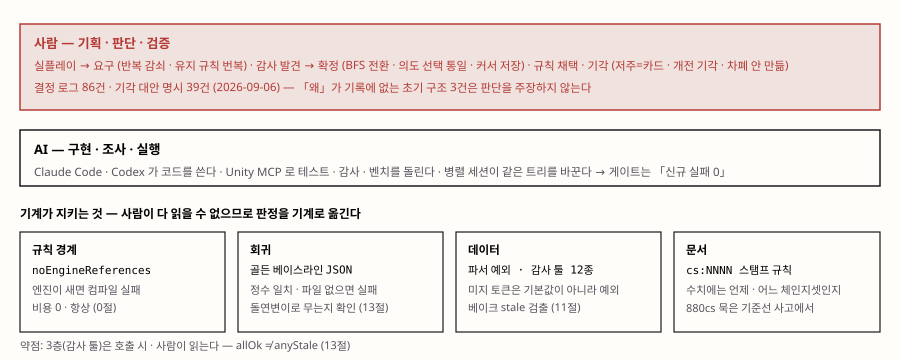</p>

이 프로젝트의 코드 대부분은 AI(Claude Code · Codex)가 썼고, Unity MCP로 에디터를 직접 조작해 테스트 실행 · 씬 감사 · 벤치마크까지 에이전트가 돌렸습니다. 이것을 숨기지 않는 이유는 단순합니다. 숨기면 코드가 반박합니다. 위 13개 절에서 「누가 왜 그렇게 골랐나」에 답이 없는 자리를 매번 표시한 것이 그 결과입니다. 이 절은 그 대신 **사람이 무엇을 책임졌는지**를 적습니다.

### 판단이 남는 세 경로

결정 로그(`DECISIONS.md`, 2026-09-06 기준 86건 · 기각 대안 명시 39건)를 시스템별로 대조하면 사람의 판단이 기록에 남는 경로가 셋으로 갈립니다.

| 경로 | 뜻 | 예 |
|---|---|---|
| 실플레이 → 요구 | 사용자가 플레이하며 문제를 제기하고 에이전트가 진단 · 구현 | 반복 감쇠(10절) · 함정 단칸 · 1회성 · 유지 규칙 번복(8절) |
| 감사 발견 → 확정 | 에이전트가 코드 · 데이터에서 문제를 찾아 선택지를 내고 사용자가 확정 | BFS 전환(2절) · 의도 선택 통일(4절) · 커서 저장(9절) |
| 규칙 채택 · 기각 | 레퍼런스 조사 뒤 사용자가 문법을 고르고 버림 | 저주 = 카드 · 개전 기각 · 차폐 안 만듦(6절) |

이 셋은 면접에서 다르게 말해야 합니다. 「에이전트 권장 → 사용자 확정」은 판단이 사용자에게 있되 대안 생성은 아니었다는 뜻이고, 「실플레이 → 요구」는 사용자가 문제를 직접 제기한 것입니다. 「이 시스템을 내가 설계했다」와 「이 시스템의 손잡이를 내가 실플레이로 정했다」는 다른 문장입니다.

### 기계가 지키는 것, 사람이 지키는 것

같은 판단이 네 번 반복됩니다. 참조 방향은 당부가 아니라 `asmdef`가(0절), 성능 회귀는 사람 눈이 아니라 골든 베이스라인이(13절), 데이터 정합은 리뷰가 아니라 감사 툴이(11절), 문서 낡음은 기억이 아니라 체인지셋 스탬프 규칙이 잡습니다. 마지막 규칙의 출처는 사고입니다. 작업 규칙 문서의 테스트 기준선 항목이 약 880체인지셋 동안 묵었는데, 읽는 사람이 그것이 얼마나 오래된 값인지 알 수 없었기 때문입니다. 그래서 「기준선 수치를 적을 때는 언제 · 어느 체인지셋에서 쟀는지를 반드시 같이 적는다」가 규칙이 됐고, 이 README의 모든 수치에 cs 번호가 붙어 있는 이유입니다.

AI가 쓴 코드를 사람이 다 읽을 수는 없습니다. 그래서 검증을 사람의 읽기에서 기계의 판정으로 옮기는 것이 이 작업 방식의 핵심이고, 「모든 새 테스트는 물어야 한다」(체크인 전에 코드를 한 번 깨서 빨개지는지 확인)는 규칙이 에이전트에게 부과된 검증 의무입니다. 결정 로그에 「돌연변이」가 16번 나옵니다.

### 이 방식에서 중점을 둔 것

**재구성을 회상처럼 말하지 않는 것.** 규칙층 분리 · 타임라인 자료구조화 · 계약 어셈블리 신설이라는 3대 구조 판단은 결정 로그(첫 항목 2026-07-02)가 시작되기 전에 서 있었고, 결정도 기각된 대안도 남아 있지 않습니다. 지금 코드를 읽고 만든 설명은 기억이 아니라 재구성입니다. 이 README는 그 자리마다 「무엇을 막고 무엇을 대가로 치르는지」까지만 쓰고 「내가 왜 그렇게 했는지」는 쓰지 않았습니다. 반대로 2026-08~09의 판단(랜덤화 손잡이 · 유지 규칙 번복 · BFS 전환 · 의도 선택 통일 · 커서 저장)은 결정 번호와 기각 대안을 들고 말할 수 있습니다.

### 트레이드오프 · 남은 문제

- **병렬 세션.** 에이전트 세션 여러 개가 같은 작업 트리를 동시에 바꿉니다. 이 리포를 export하는 동안에도 미체크인 변경이 4파일에서 24파일로 늘었습니다. 대응은 「게이트는 총수 비교가 아니라 신규 실패 0」 · 「트리가 깨진 상태로 체크인하지 않는다」 · 다른 트랙이 편집 중인 파일은 손대지 않고 새 파셜에 두기(9절의 커서 필드)였고, 인계문마다 그 주의가 적혀 있습니다.
- **큰 클래스.** `CombatState`는 partial 34파일 · 14,556줄, `MapCombatController`는 partial 15파일 · 13,352줄(본체 2,241줄)입니다(cs:1391). 2026-09-04 구조 리팩토링은 「호스트의 직렬화 · 사설 필드를 직접 쓰면 호스트에 남기고, 호스트 서비스를 부르기만 하면 파사드로 뽑는다」는 절단 규칙을 세워 뽑을 수 있는 것만 뽑고(DEC-2026-09-04-02 · -03 · -04), 몬스터 공격 해소처럼 호스트 멤버 34개를 만지는 것은 잔류로 판정하고 근거를 남겼습니다. 「거대 클래스를 해결했다」가 아니라 「분리 가능한 것과 불가능한 것을 규칙으로 갈랐다」입니다.
- **기록이 정본 밖에 사는 문제.** 되돌림(6절 cs:1212) · 반복 감쇠(10절) · 봉인 재선정 수리(8절)처럼 결정이 체인지셋 코멘트 · 코드 주석에만 남은 경우가 반복됐고, 2026-09-05에 일부를 결정 로그로 소급 등재했습니다. 결정이 없는 것이 아니라 정본 밖에 있는 문제이고, 그것을 찾는 조사가 이 README의 원천이었습니다.
- **감사 결과를 읽는 것은 여전히 사람입니다.** 13절의 `allOk` 사례처럼 게이트가 잡아도 판정이 통과로 읽힐 수 있습니다. 검출을 2층(테스트)으로 내려 상시화할지가 남은 결정입니다.

> 근거 · `DECISIONS.md` 86건 grep(2026-09-06) · 작업 규칙 문서의 테스트 작성 규칙 · 기준선 스탬프 규칙(비공개, 규칙 문장만 인용) · 각 절의 「누가 판단했나」 대조 · 이 리포 export 중 `cm status` 관찰

<br>

# 🕹️ 인게임 영상

<!-- TODO(D-5): 트레일러 링크 · 인게임 스크린샷 -->

(준비 중)

<br>

# 라이선스

- `Source/`·`Tests/`의 코드: [MIT](LICENSE)
- README 본문과 `ReadMeSource/`의 도식·이미지: [CC BY-NC 4.0](https://creativecommons.org/licenses/by-nc/4.0/)
