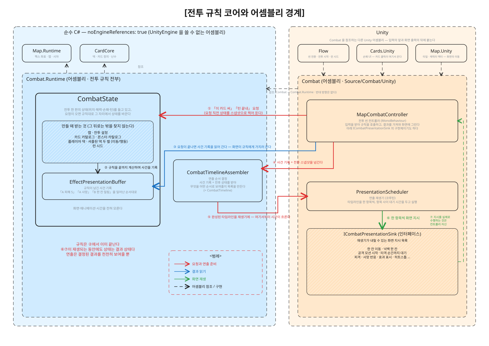
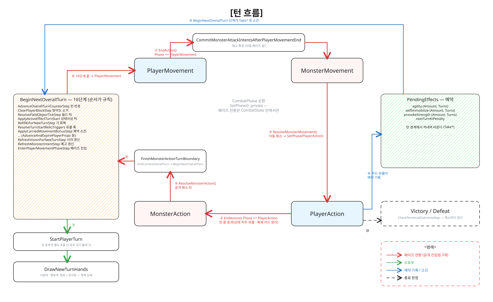
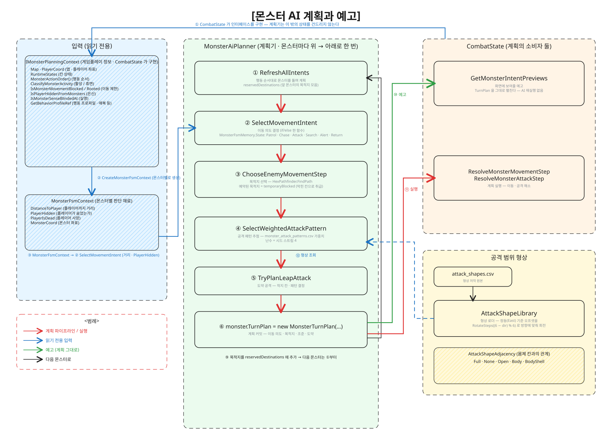
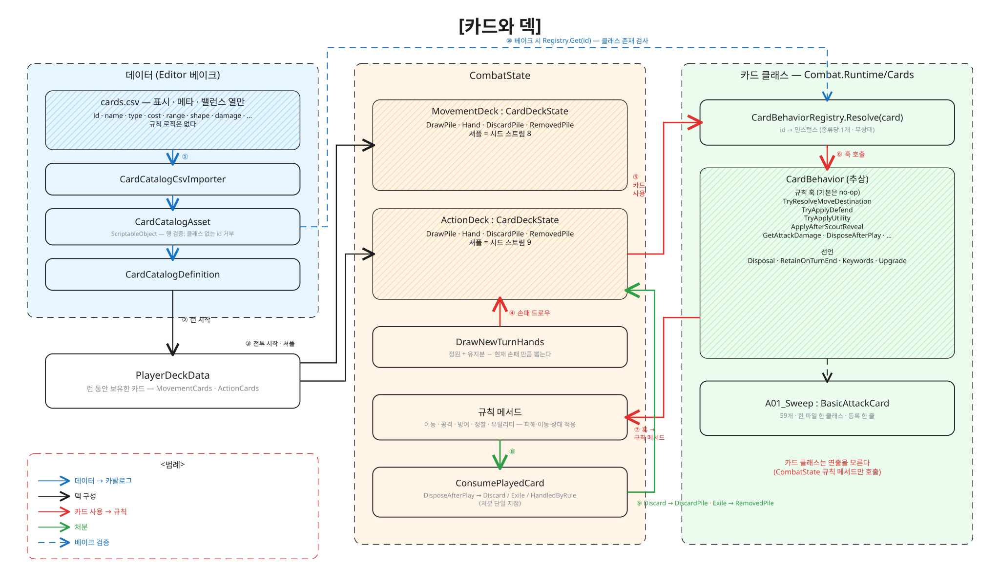
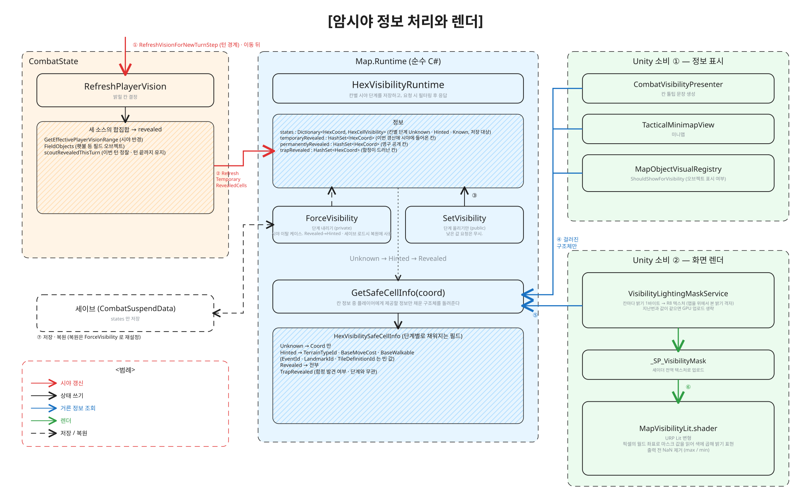
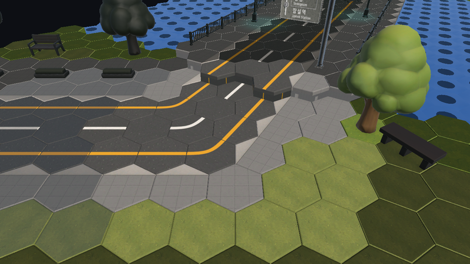
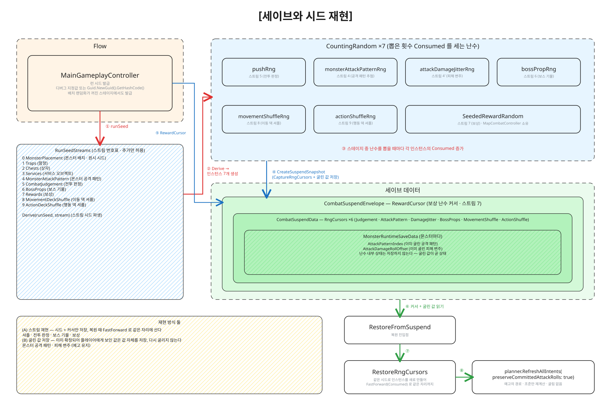
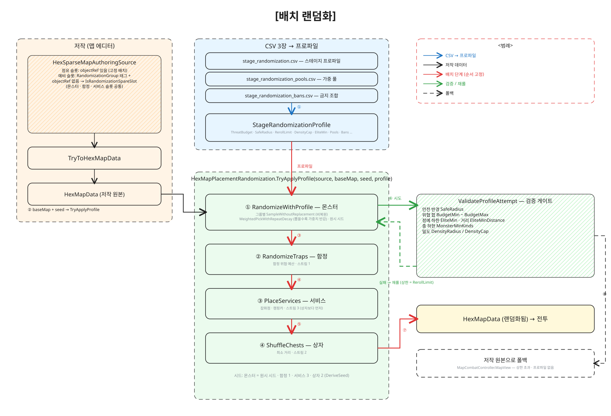

# 기억결 (Memorystone)

<!-- TODO(D-5): 배너 이미지 — 트레일러 스틸 또는 키아트. ReadMeSource/0.Banner.png -->

> 이 리포는 **소스 열람용**이며 빌드 대상이 아닙니다. 씬·아트·오디오·서드파티 에셋·데이터 CSV는 포함하지 않습니다.
> Plastic SCM `/main/dev` **cs:1420** (2026-09-07).

- **장르** : 턴제 헥스 전술 · 덱빌딩 로그라이크
- **도구** : Unity 6000.3 · C# · Plastic SCM · Claude Code / Codex + Unity MCP
- **팀** : 2인 (프로그래밍 1 · 아트 1)
- **플랫폼** : PC
- **기간** : 2026-05 → 2026-09
- **수상** : 제1회 서울 플레이업 AI 게임 챌린지 353팀 중 상위 8팀 · 2026 GES 전시 예정

<br>

# ❗개요

서울을 무대로 한 턴제 헥스 전술 덱빌딩 로그라이크입니다.

플레이어는 카드를 사용하여 이동, 전투, 정찰을 하고 육각 타일 맵을 탐험합니다.

턴 페이즈의 흐름은 다음 사진과 같습니다. 

(사진 첨부 예정)

몬스터는 다음 턴의 행동을 미리 예고합니다.

(사진 첨부 예정)

코드는 세 축으로 나뉩니다. **규칙층은 순수 C#**(UnityEngine 참조가 컴파일 단계에서 금지된 어셈블리 3개)이고, **화면 연출은 규칙의 결과로부터 파생**되며, **데이터의 원본은 코드가 아니라 CSV로 관리**됩니다. 모든 구현은 AI 도구(Claude Code · Codex)로 했고, 설계 판단과 검증은 사람이 맡았습니다.

아래 7개 절은 대표 시스템에 대해서 설명합니다.

<br>

# 📜 목차

1. [게임플레이 연산과 화면 연출 처리](#1-게임플레이-연산과-화면-연출-처리)
2. [턴 페이즈와 턴 경계 처리](#2-턴-페이즈와-턴-경계-처리)
3. [몬스터 AI 계획과 예고](#3-몬스터-ai-계획과-예고)
4. [카드 데이터와 카드 클래스](#4-카드-데이터와-카드-클래스)
5. [암시야 정보 처리와 렌더](#5-암시야-정보-처리와-렌더)
6. [세이브와 시드 재현](#6-세이브와-시드-재현)
7. [맵 배치 랜덤화](#7-맵-배치-랜덤화)
- [🕹️ 인게임 영상](#️-인게임-영상)

<br>

# 🖥️ 개발 내용

## 1. 게임플레이 연산과 화면 연출 처리

<p align="center"></p>

게임플레이 코드는 **연산**과 **화면 연출**로 나뉩니다. 연산은 순수 C# 어셈블리(`Combat.Runtime` · `Map.Runtime` · `CardCore`)에 있고, 연출은 Unity 어셈블리(`Combat` 등)에 있습니다. 여기서 게임플레이 연산은 스테이지 맵 하나 안에서 일어나는 규칙 전체(이동 · 카드 · 몬스터 · 함정 · 상점 · 시야 · 유물)를 뜻합니다. 코드 이름의 `Combat`은 이 범위를 가리킵니다.

연산 어셈블리는 `noEngineReferences: true`라서 `UnityEngine`을 쓸 수 없습니다. 참조는 Unity → 순수 C# 어셈블리 한 방향으로 이루어집니다. 따라서 연산 코드가 화면을 건드리는 일은 컴파일 단계에서 불가능합니다.

도식의 상자는 각각 이런 역할입니다.

- **CombatState** — 게임플레이 상태(위치 · 체력 · 손패 · 턴 · 시야 · 유물)를 갖고 있고, 요청이 오면 규칙대로 연산을 실행합니다.
- **EffectPresentationBuffer** — 연산 결과(`EffectResultEvent`)를 일어난 순서대로 기록합니다.
- **CombatTimelineAssembler** — 연산 결과 기록을 받아 연출 순서 목록(`CombatTimeline`)을 만듭니다.
- **MapCombatController** — 스테이지 컨트롤러(`MonoBehaviour`)입니다. 입력을 받아 연산을 요청하고, 결과를 가져와 화면에 그립니다.
- **PresentationScheduler** — 연출 스케줄러입니다. 타임라인을 한 항목씩, 대기 시간을 두고 실행합니다.
- **ICombatPresentationSink** — 스케줄러가 내릴 수 있는 화면 지시 목록(인터페이스)입니다. 구현체는 `MapCombatController`입니다.

### 이 시스템에서 중점을 둔 것

어셈블리를 통해 게임플레이 연산 코드에서는 Unity의 화면 코드를 참조하지 못하도록 강제하였습니다. 그로 인해 `Tests/EditMode/Combat`의 테스트는 Unity 씬 없이 `CombatState`만 만들어 순수 C#만으로 연산을 검증하는 것이 가능했습니다. AI로 작업 시 병렬 세션 간의 맥락 공유가 어려워 잦은 테스트가 요구된다는 점과 Unity 에디터 점유가 한번에 한 세션만 가능하다는 문제 때문에 최대한 구현에서 에디터에 의존하는 경우를 줄이고자 이러한 구조를 채택하였습니다.

### 코드

`Source/Combat/Runtime/SeoulPlayup.Combat.Runtime.asmdef` — 연산 어셈블리 정의 전문. 참조는 순수 어셈블리 둘뿐이고 엔진 참조는 꺼져 있습니다.

```json
{
    "name": "SeoulPlayup.Combat.Runtime",
    "rootNamespace": "SeoulPlayup.Combat.Runtime",
    "references": [
        "SeoulPlayup.CardCore",
        "SeoulPlayup.Map.Runtime"
    ],
    "includePlatforms": [],
    "excludePlatforms": [],
    "allowUnsafeCode": false,
    "overrideReferences": false,
    "precompiledReferences": [],
    "autoReferenced": true,
    "defineConstraints": [],
    "versionDefines": [],
    "noEngineReferences": true
}
```

<br>

## 2. 턴 페이즈와 턴 경계 처리

<p align="center"></p>

한 턴은 네 페이즈 `PlayerMovement → MonsterMovement → PlayerAction → MonsterAction`을 한 바퀴 돕니다. 페이즈를 바꾸는 함수는 `CombatState` 안에만 있고(`SetPhase`, private), 밖에서 부를 수 있는 진입점은 셋입니다.

턴과 턴 사이의 처리(턴 경계)는 `BeginNextOverallTurn` 한 함수가 16단계를 정해진 순서로 실행합니다. 「다음 턴에 발동하는 효과」는 `PendingEffects`에 예약해 두었다가 이 경계에서 꺼내 적용합니다.

도식의 상자는 각각 이런 역할입니다.

- **EndAction()** — 플레이어가 페이즈를 끝낼 때 부르는 진입점입니다. 이동 페이즈라면 몬스터 공격 예고를 확정하고 몬스터 이동으로, 행동 페이즈라면 턴 끝 효과(상태이상 · 저주 · 유물)를 처리하고 몬스터 액션으로 넘깁니다.
- **ResolveMonsterMovement()** — 몬스터의 계획된 이동을 실행하고 플레이어 행동 페이즈로 넘깁니다.
- **ResolveMonsterAction()** — 몬스터의 공격을 실행한 뒤 턴 경계(`FinishMonsterActionTurnBoundary`)로 들어갑니다.
- **BeginNextOverallTurn** — 턴 경계 16단계. 턴 번호 증가 → 방어도 소거 → 필드 오브젝트 틱 → 상태이상 틱 → 기 회복 → 유물 훅 → 예약 소진 → 시야 갱신 → 몬스터 예고 갱신 → `PlayerMovement` 진입 순입니다.
- **StartPlayerTurn / DrawNewTurnHands** — 턴 경계가 끝난 뒤 새 손패를 뽑습니다. 정원에 유지 카드 수를 더한 만큼 채웁니다.
- **PendingEffects** — 다음 턴에 발동할 효과의 예약(값 · 지속 턴). 카드나 유물이 기록하고, 턴 경계의 해당 단계가 `Take*`로 꺼내면서 비웁니다. 한 번 꺼내면 기본값으로 돌아가므로 두 번 발동하지 않습니다.
- **Victory / Defeat** — 해소가 끝날 때마다 `CheckTerminalOutcomeStep`이 승패를 확인합니다.

### 이 시스템에서 중점을 둔 것

턴 진행은 동기 함수 방식입니다. 진입점을 한 번 부르면 그 페이즈의 규칙과 턴 경계 16단계가 한 번에 끝까지 실행되게 됩니다. 1절에서 연출을 연산 결과로부터 파생이라고 할 수 있는데, 연산이 한 번에 끝나야 결과 기록이 완성될 수 있고 그 기록으로부터 연출 재생이 가능해질 수 있습니다.

### 코드

`Source/Combat/Runtime/CombatState.cs` — `BeginNextOverallTurn` 본문. 이 19줄이 턴 경계의 전부입니다.

```csharp
private void BeginNextOverallTurn(int freshStatusStartIndex)
{
    AdvanceOverallTurnCounterStep();
    ClearPlayerBlockStep();
    ActivatePendingFieldObjects();
    ResolveFieldObjectTickStep();
    ApplyActiveEffectTurnStart(freshStatusStartIndex);
    RefillKiForNewTurnStep();
    TickLimitedRelicTurnsStep();
    ResolveTurnStartRelicTriggers();
    ApplyCarriedMovementBonusStep();
    ApplyPendingSelfImmobilize();
    ApplyPendingProvokeStrength();
    ResetPerTurnSignalsStep();
    AdvanceAndExpirePlayerProps();
    RefreshVisionForNewTurnStep();
    RefreshMonsterIntentStep();
    EnterPlayerMovementPhaseStep();
}
```

<br>

## 3. 몬스터 AI 계획과 예고

<p align="center"></p>

몬스터 AI는 `MonsterAiPlanner` 한 클래스가 몬스터마다 위에서 아래로 한 번 흐르는 계획기입니다. 입력은 `IMonsterPlanningContext` 인터페이스로만 읽고, 결과는 `MonsterRuntime.TurnPlan`에 씁니다. 실제 피해와 이동을 적용하는 해소는 플래너에 없고 `CombatState`에 있습니다.

플레이어에게 보이는 예고와 다음 턴에 실행되는 행동은 같은 `TurnPlan`에서 나옵니다. 예고를 만들 때 AI를 다시 돌리지 않습니다.

도식의 상자는 각각 이런 역할입니다.

- **IMonsterPlanningContext** — 플래너가 읽을 수 있는 게임플레이 정보(맵 · 플레이어 좌표 · 행동 순서 · 은신 · 실명 · 행동 프로파일). `CombatState`가 구현합니다.
- **MonsterFsmContext** — 몬스터 하나에 대한 판단 재료(플레이어까지 거리 · 플레이어가 숨었는지 · 죽었는지).
- **① RefreshAllIntents** — 행동 순서대로 몬스터를 돌며 계획을 세웁니다. 앞 몬스터의 목적지를 `reservedDestinations`에 모아 뒤 몬스터에 넘깁니다.
- **② SelectMovementIntent** — `MonsterFsmMemory`의 상태(Patrol · Chase · Attack · Search · Alert · Return)를 갱신해 이동 의도를 정합니다. if/else 한 함수입니다.
- **③ ChooseEnemyMovementStep** — `HexPathfinder.FindPath`로 목적지를 고릅니다. 예약된 목적지는 막힌 칸으로 취급해 두 몬스터가 같은 칸으로 몰리지 않게 합니다.
- **④ SelectWeightedAttackPattern** — `monster_attack_patterns.csv`의 가중치로 공격 패턴을 추첨합니다. 난수는 시드 스트림 4를 씁니다.
- **⑤ TryPlanLeapAttack** — 도약 공격이 가능하면 착지 칸과 패턴을 정합니다.
- **⑥ MonsterTurnPlan 커밋** — 이동 의도 · 목적지 · 조준 · 도약을 `monster.TurnPlan`에 기록합니다.
- **GetMonsterIntentPreviews** — 화면에 보여 줄 예고. `TurnPlan`을 그대로 펼칩니다.
- **ResolveMonsterMovementStep / ResolveMonsterAttackStep** — 같은 `TurnPlan`을 실제로 실행합니다.
- **AttackShapeLibrary** — `attack_shapes.csv`의 공격 범위 형상. 정동 방향 기준 오프셋을 `RotateSteps((6 − dir) % 6)`으로 회전해 씁니다. `AttackShapeAdjacency`(Full · None · Open · Body · BodyShell)가 몸체 칸과의 관계를 정합니다.

### 이 시스템에서 중점을 둔 것

예고가 곧 계획입니다. 화면에 그려지는 예고와 다음 턴에 실행되는 행동이 같은 `TurnPlan` 객체에서 나오므로 둘이 어긋날 여지가 없습니다. 플래너는 컨텍스트 밖의 상태를 건드리지 않고, 유일한 가변 상태는 패턴 추첨 난수뿐입니다.

### 코드

`Source/Combat/Runtime/MonsterAiPlanner.cs` — `RefreshAllIntents`의 예약 루프. 죽었거나 휴면인 몬스터는 비활성 계획을 받고, 나머지는 앞 몬스터의 예약 목적지를 넘겨받으며 계획을 세웁니다.

```csharp
    var reservedDestinations = new HashSet<HexCoord>();
    foreach (var monster in context.MonsterActionOrder())
    {
        monster.ActivityState = context.ClassifyMonsterActivity(monster);
        if (monster.Combatant.IsDead || monster.ActivityState == MonsterActivityState.Dormant)
        {
            var intent = new EnemyIntent(EnemyIntentType.Patrol, PlayerCoord.DistanceTo(monster.Coord), monster.Coord, PlayerCoord);
            monster.Intent = intent;
            monster.LockedFacingIntent = intent;
            monster.IntentPredictedMoveCoord = monster.Coord;
            monster.PendingAttackIntent = false;
            monster.PlannedLeap = false;
            monster.TurnPlan = MonsterTurnPlan.Inactive(monster.Coord);
            continue;
        }

        RefreshTurnPlan(monster, reservedDestinations, preserveCommittedAttackRolls);
        if (monster.TurnPlan.IsActive)
        {
            reservedDestinations.Add(monster.TurnPlan.PlannedMoveCoord);
        }
    }
}
```

<br>

## 4. 카드 데이터와 카드 클래스

<p align="center"></p>

카드 하나는 두 조각으로 되어 있습니다. 표시 · 밸런스 값은 `cards.csv`의 한 행이고, 규칙은 `Combat.Runtime/Cards/`의 클래스 하나입니다. 둘은 카드 id로만 이어집니다.

스테이지 중 덱은 이동 덱과 행동 덱 두 벌이며, 각각 뽑을 더미 · 손패 · 버림 더미 · 소멸 더미 네 개로 이루어집니다. 카드를 쓰면 `CombatState`가 카드 클래스를 찾아 규칙 훅을 호출하고, 다 쓴 카드의 처분은 `ConsumePlayedCard` 한 곳에서 정합니다.

도식의 상자는 각각 이런 역할입니다.

- **cards.csv** — 이름 · 설명 · 타입 · 비용 · 사거리 · 형상 · 피해 같은 표시와 밸런스 열. 규칙 로직은 없습니다.
- **CardCatalogCsvImporter / CardCatalogAsset** — 에디터에서 CSV를 에셋으로 베이크합니다. 행의 id에 대응하는 카드 클래스가 없으면 거부합니다.
- **CardCatalogDefinition** — 런타임 카드 카탈로그.
- **PlayerDeckData** — 런 동안 보유한 카드 목록(`MovementCards` · `ActionCards`).
- **MovementDeck / ActionDeck (CardDeckState)** — 스테이지 중 덱 두 벌. `DrawPile` · `Hand` · `DiscardPile` · `RemovedPile`. 셔플 난수는 시드 스트림 8 · 9.
- **DrawNewTurnHands** — 턴마다 정원에 유지 카드 수를 더한 만큼 손패를 채웁니다.
- **CardBehaviorRegistry.Resolve(card)** — 카드 id로 카드 클래스 인스턴스를 찾습니다. 종류당 한 인스턴스이고 상태가 없습니다.
- **CardBehavior** — 카드 클래스의 추상 기반. 규칙 훅(`TryResolveMoveDestination` · `TryApplyDefend` · `TryApplyUtility` · `ApplyAfterScoutReveal` · `GetAttackDamage` …)과 선언(`Disposal` · `RetainOnTurnEnd` · `Keywords` · `Upgrade`)을 가집니다. 훅은 기본이 no-op입니다.
- **A01_Sweep** — 카드 클래스 하나의 예. 59개가 한 파일 한 클래스이고 등록은 한 줄입니다.
- **ConsumePlayedCard** — 다 쓴 카드를 `DisposeAfterPlay`의 답에 따라 버림 더미 · 소멸 더미로 보내거나 그대로 둡니다.

### 이 시스템에서 중점을 둔 것

카드 하나의 규칙이 클래스 하나에 모여 있고, `CombatState`가 카드를 부르는 지점은 `Resolve` 호출부로 한정됩니다. 밸런스 수정은 CSV에서, 규칙 수정은 클래스에서 끝납니다. 카드 클래스는 화면 연출을 전혀 모르고 `CombatState`의 연산 메서드만 호출합니다.

### 코드

`Source/Combat/Runtime/Cards/Attack/A01_Sweep.cs` — 카드 클래스 하나의 전문. 기본 공격 카드라 훅 override 없이 id와 강화 규칙만 선언합니다.

```csharp
using SeoulPlayup.CardCore;

namespace SeoulPlayup.Combat.Runtime.Cards
{
    /// <summary>A01 휘둘러치기 — 플레이어 주변 {Shape} 내의 적 모두에게 피해 {Damage}를 줍니다. (옛 behaviorId `attack.damage`)</summary>
    public sealed class A01_Sweep : BasicAttackCard
    {
        public override string Id => "A01";

        /// <summary>연마(옛 card_upgrades.csv): 자기 주변 blast라 형상 유지·피해 3→5.</summary>
        public override CardDefinition Upgrade(CardDefinition card, int level) => card.With(amount: 5);
    }
}
```

`Source/Combat/Runtime/CombatState.cs` — `ConsumePlayedCard`. 사용한 카드의 처분을 결정하는 유일한 지점입니다.

```csharp
private void ConsumePlayedCard(CardDeckState deck, CardDefinition card)
{
    if (card == null)
    {
        return;
    }

    switch (CardBehaviorRegistry.Resolve(card).DisposeAfterPlay(this, card))
    {
        case CardDisposal.Exile:
            deck.PermanentRemoveFromHand(card);
            return;
        case CardDisposal.HandledByRule:
            // 규칙이 손패 전체를 버렸다(U01). 재드로우로 같은 카드가 다시 손에 왔다면 그것은 새로 뽑은 손패다 — 건드리지 않는다.
            return;
        default:
            deck.DiscardFromHand(card);
            return;
    }
}
```

<br>

## 5. 암시야 정보 처리와 렌더

<p align="center"></p>

칸마다 시야 단계가 `Unknown → Hinted → Revealed` 셋 중 하나입니다. `CombatState`가 시야 반경 · 필드 오브젝트 · 정찰 카드를 합쳐 밝힐 칸을 정하고, `HexVisibilityRuntime`이 단계를 관리합니다.

Unity 쪽은 칸의 상태를 직접 읽지 않고 `GetSafeCellInfo`가 단계에 맞게 걸러 준 구조체만 받습니다. 툴팁 · 미니맵 · 오브젝트 표시가 이 구조체를 쓰고, 화면의 어둠도 같은 구조체에서 마스크 텍스처로 만들어 셰이더가 샘플링합니다.

도식의 상자는 각각 이런 역할입니다.

- **RefreshPlayerVision** — 시야 반경(`GetEffectivePlayerVisionRange`) · 필드 오브젝트(`FieldObjects`) · 이번 턴 정찰(`scoutRevealedThisTurn`)을 합쳐 밝힐 칸 집합을 만듭니다. 턴 경계와 이동 뒤에 불립니다.
- **HexVisibilityRuntime** — 칸별 단계 `states`(저장 대상)와 보조 집합(`temporaryRevealed` · `permanentlyRevealed` · `trapRevealed`)을 가집니다. `SetVisibility`는 단계를 올리기만 하고, 내리는 `ForceVisibility`는 세이브 복원에만 씁니다.
- **GetSafeCellInfo → HexVisibilitySafeCellInfo** — 단계별로 거른 정보. `Unknown`은 좌표만, `Hinted`는 지형 · 이동 비용만(이벤트 · 랜드마크 id는 비움), `Revealed`는 전부.
- **CombatVisibilityPresenter / TacticalMinimapView / MapObjectVisualRegistry** — 툴팁 · 미니맵 · 오브젝트 표시 여부. 전부 걸러진 구조체만 봅니다.
- **VisibilityLightingMaskService** — 칸 단계를 바이트 마스크 텍스처로 굽습니다. 바뀐 슬롯이 없으면 업로드를 건너뜁니다.
- **MapVisibilityLit.shader** — URP Lit 변형. 픽셀의 월드 좌표를 마스크 UV로 바꿔 샘플링해 밝기를 정하고, 출력 전에 NaN을 씻습니다.

<p align="center">


</p>

### 이 시스템에서 중점을 둔 것

정보 은닉을 자료구조에서 처리합니다. 보이지 않는 칸의 이벤트나 랜드마크는 Unity 쪽 코드에 전달되지 않으므로 UI가 실수로 그릴 수 없습니다. 렌더 마스크도 같은 구조체에서 나오므로 연산의 시야와 화면의 시야가 한 소스를 공유합니다.

### 코드

`Source/Map/Runtime/HexVisibilityRuntime.cs` — `GetSafeCellInfo` 앞부분. 단계별로 무엇을 비우는지가 생성자 인자에 그대로 드러납니다.

```csharp
public HexVisibilitySafeCellInfo GetSafeCellInfo(HexCoord coord)
{
    if (!Map.TryGetCell(coord, out var cell))
    {
        return HexVisibilitySafeCellInfo.Missing(coord);
    }

    var visibility = GetVisibility(coord);
    if (visibility == HexCellVisibility.Unknown)
    {
        return HexVisibilitySafeCellInfo.Unknown(coord);
    }

    var isTrapRevealed = trapRevealed.Contains(coord);
    if (visibility == HexCellVisibility.Hinted)
    {
        return new HexVisibilitySafeCellInfo(
            coord,
            visibility,
            true,
            true,
            false,
            string.Empty,
            cell.TerrainTypeId,
            cell.BaseMoveCost,
            cell.BaseWalkable,
            cell.BaseBlocksVision,
            string.Empty,
            string.Empty,
            cell.VisualFloor,
            isTrapRevealed);
    }
```

<br>

## 6. 세이브와 시드 재현

<p align="center"></p>

런 하나에 시드 하나가 발급되고, 용도별로 번호(0~9)를 붙여 파생한 스트림 시드로 난수 인스턴스를 만듭니다. 각 인스턴스는 `CountingRandom`이라서 지금까지 몇 번 뽑았는지(`Consumed`)를 셉니다.

세이브는 난수의 내부 상태를 저장하지 않습니다. 대신 각 인스턴스의 `Consumed`(커서)와, 이미 굴려서 플레이어에게 보인 값(몬스터 공격 패턴 · 피해 변주)을 저장합니다. 복원은 같은 시드로 인스턴스를 새로 만들어 커서까지 `FastForward`하고, 굴린 값은 다시 굴리지 않습니다.

도식의 상자는 각각 이런 역할입니다.

- **MainGameplayController** — 런 시드 발급. 디버그 지정값이 있으면 그것을, 없으면 무작위.
- **RunSeedStreams** — 번호표. 0 몬스터 배치 · 1 함정 · 2 상자 · 3 서비스 · 4 공격 패턴 · 5 전투 판정 · 6 보스 기물 · 7 보상 · 8 이동 덱 셔플 · 9 행동 덱 셔플. `Derive(runSeed, stream)`으로 스트림 시드를 만듭니다. 번호는 추가만 하고 바꾸지 않습니다.
- **CountingRandom ×7** — `pushRng`(5) · `monsterAttackPatternRng`(4) · `attackDamageJitterRng`(4′) · `bossPropRng`(6) · `movementShuffleRng`(8) · `actionShuffleRng`(9) · `SeededRewardRandom`(7, 컨트롤러 소유).
- **CombatSuspendEnvelope / CombatSuspendData / MonsterRuntimeSaveData** — 저장 구조. 봉투가 보상 커서, 데이터가 커서 여섯(`RngCursors`), 몬스터별 저장이 `AttackPatternIndex` · `AttackDamageRollOffset`.
- **CreateSuspendSnapshot / RestoreFromSuspend** — 저장과 복원 진입점.
- **RestoreRngCursors** — 같은 시드로 인스턴스를 새로 만들어 `FastForward(Consumed)`.
- **RefreshAllIntents(preserveCommittedAttackRolls: true)** — 복원 뒤 몬스터 예고의 기하(경로 · 조준 · 도약)만 다시 세우고 굴림은 하지 않습니다.

### 이 시스템에서 중점을 둔 것

재현 방식이 둘입니다. 아직 굴리지 않은 것은 시드 + 커서로 재현하고, 이미 굴려서 보인 것은 값 자체로 저장합니다. 예고된 공격을 복원 뒤 다시 굴리면 플레이어가 본 것과 다른 공격이 나오므로 그런 값은 상태로 취급합니다. 용도별 스트림을 나눈 것은 한쪽 소비량이 다른 쪽 결과를 밀지 않게 하기 위해서입니다.

### 코드

`Source/Map/Runtime/RunSeedStreams.cs` — 번호표 전문과 `Derive`. 각 번호의 주석이 그 스트림이 어디서 소비되는지를 적고 있습니다.

```csharp
/// <summary>몬스터 슬롯 셔플·풀 추첨. 파생 없이 원시 시드(번호는 문서용).</summary>
public const int MonsterPlacement = 0;
/// <summary>함정 슬롯 승격·프리셋 치환.</summary>
public const int Traps = 1;
/// <summary>상자 좌표 셔플.</summary>
public const int Chests = 2;
/// <summary>서비스 오브젝트(잡화점·캠핑카) 배치.</summary>
public const int Services = 3;
/// <summary>스폰 시 체력 변주(hpVariancePct). 3을 공유하되 spawnRefId로 재혼합.</summary>
public const int SpawnHpVariance = 3;
/// <summary>몬스터 공격 패턴 선택 + 피해 변주(<c>MonsterAiPlanner</c>).</summary>
public const int MonsterAttackPattern = 4;
/// <summary>전투 판정(<c>CombatState.pushRng</c>): 취약 부위·빠른 거북·순간이동지·전염 대상·되돌릴 부적·제거될 카드.</summary>
public const int CombatJudgement = 5;
/// <summary>보스 기물 볼리의 링 회전각.</summary>
public const int BossProps = 6;
/// <summary>보상·상점·뽑기·전리품(<c>IRewardRandom</c>).</summary>
public const int Rewards = 7;
/// <summary>이동덱 셔플. 행동덱과 갈라 둔다 — 한쪽 소비량이 다른 쪽을 밀면 안 된다.</summary>
public const int MovementDeckShuffle = 8;
/// <summary>행동덱 셔플.</summary>
public const int ActionDeckShuffle = 9;

/// <summary>런 시드에서 <paramref name="stream"/>번 스트림의 시드를 뽑는다.</summary>
public static int Derive(int runSeed, int stream)
{
    return PlacementRandomizer.DeriveSeed(runSeed, stream);
}
```

<br>

## 7. 맵 배치 랜덤화

<p align="center"></p>

맵 에디터에서 저작한 슬롯 중 예비 슬롯(그룹 태그만 있고 오브젝트가 비어 있는 칸)을 랜덤화가 채웁니다. 무엇이 올 수 있는가는 에디터의 슬롯 문법이, 무엇이 실제로 오는가는 CSV 프로파일과 시드가 정합니다.

배치는 몬스터 → 함정 → 서비스 → 상자 네 단계를 정해진 순서로 지나고, 몬스터 배치 결과는 검증 게이트를 통과해야 합니다. 실패하면 재롤하고, 상한을 넘기면 저작 원본으로 진행합니다.

도식의 상자는 각각 이런 역할입니다.

- **HexSparseMapAuthoringSource** — 저작 데이터. `objectRef`가 있는 점유 슬롯은 고정, `RandomizationGroup` 태그만 있는 예비 슬롯(`IsRandomizationSpareSlot`)은 랜덤화 후보.
- **stage_randomization.csv / _pools.csv / _bans.csv → StageRandomizationProfile** — 스테이지 프로파일(위협 예산 · 안전 반경 · 재롤 상한 · 밀도 · 정예 하한) · 가중 풀 · 금지 조합.
- **① RandomizeWithProfile** — 몬스터. 그룹별로 슬롯을 비복원 추첨하고, 풀에서 종을 고를 때 이미 뽑힌 종은 가중치를 반감합니다(`WeightedPickWithRepeatDecay`).
- **② RandomizeTraps / ③ PlaceServices / ④ ShuffleChests** — 함정 · 서비스 오브젝트 · 상자. 각각 시드 스트림 1 · 3 · 2.
- **ValidateProfileAttempt** — 안전 반경 · 위협 합 범위 · 정예 하한과 거리 · 종 하한 · 밀도 상한을 검사합니다. 하나라도 어긋나면 재롤(상한은 프로파일의 `RerollLimit`).
- **HexMapData** — 통과하면 랜덤화된 맵이 스테이지로 갑니다. 실패하거나 프로파일이 없으면 저작 원본 그대로.

### 이 시스템에서 중점을 둔 것

저작과 랜덤화의 역할 분담입니다. 어디에 무엇이 올 수 있는가는 맵 에디터의 슬롯 문법이 정하고, 그중 무엇이 실제로 오는가는 CSV 프로파일과 시드가 정합니다. 검증 게이트는 랜덤 결과가 스테이지 의도를 벗어나지 않게 막는 마지막 층이며, 실패해도 저작 원본이라는 안전한 결과가 남습니다.

### 코드

`Source/Map/Runtime/PlacementRandomizer.cs` — `WeightedPickWithRepeatDecay`. 이미 뽑힌 횟수에 따라 감쇠된 가중치로 룰렛 추첨을 합니다.

```csharp
private static StageRandomizationPoolEntry WeightedPickWithRepeatDecay(
    IReadOnlyList<StageRandomizationPoolEntry> entries,
    Random rng,
    IReadOnlyDictionary<string, int> alreadyPicked)
{
    var weights = new int[entries.Count];
    var total = 0;
    for (var index = 0; index < entries.Count; index++)
    {
        weights[index] = DecayedWeight(entries[index], alreadyPicked);
        total += weights[index];
    }

    var roll = rng.Next(total);
    for (var index = 0; index < entries.Count; index++)
    {
        roll -= weights[index];
        if (roll < 0)
        {
            return entries[index];
        }
    }

    return entries[entries.Count - 1];
}
```

<br>

# 🕹️ 인게임 영상

https://www.youtube.com/watch?v=MzOR5wWA2Xk

<br>

# 라이선스

- `Source/`·`Tests/`의 코드: [MIT](LICENSE)
- README 본문과 `ReadMeSource/`의 도식·이미지: [CC BY-NC 4.0](https://creativecommons.org/licenses/by-nc/4.0/)
