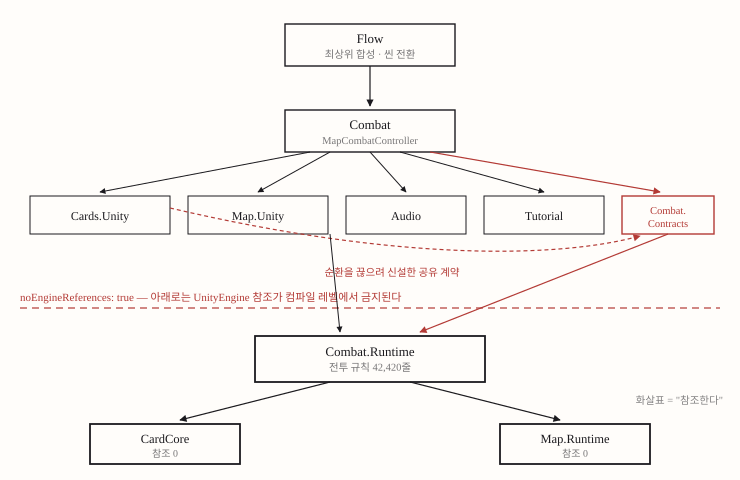
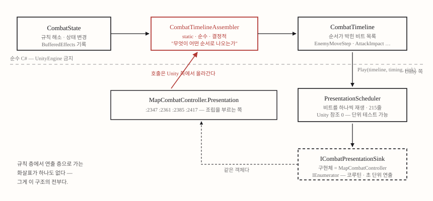

# 기억결 (Memorystone)

<!-- TODO(D-5): 배너 이미지 — 트레일러 스틸 또는 키아트. ReadMeSource/00.Banner.png -->

> 이 리포는 **소스 열람용 발췌**이며 빌드 대상이 아닙니다. 씬·아트·오디오·서드파티 에셋·데이터 CSV는 포함하지 않습니다.
> 발췌 기준: Plastic SCM `/main/dev` **cs:1391** (2026-09-06). README의 파일 경로와 코드 발췌는 전부 이 리포 안의 파일입니다.

- **장르** : 턴제 헥스 전술 · 덱빌딩 로그라이크
- **도구** : Unity 6000.3 · C# · Plastic SCM · Claude Code / Codex + Unity MCP
- **팀** : 2인 (프로그래밍 1 · 아트 1)
- **플랫폼** : PC
- **기간** : 2026-05 → 2026-09
- **수상** : 제1회 서울 플레이업 AI 게임 챌린지 353팀 중 상위 8팀 · 2026 GES 전시

<br>

# ❗개요

서울을 무대로 한 턴제 헥스 전술 덱빌딩 로그라이크입니다. 플레이어는 이동 덱과 행동 덱 두 벌로 육각 타일 위를 움직이고, 몬스터는 다음 턴의 행동을 미리 예고합니다.

코드는 세 축으로 나뉩니다. **규칙층은 순수 C#**(UnityEngine 참조가 컴파일 단계에서 금지된 어셈블리 3개)이고, **연출은 규칙이 남긴 산출물에서 파생**되며, **밸런스는 코드가 아니라 CSV**에 있습니다.

구현의 대부분은 AI(Claude Code · Codex)가 썼습니다. 이 README는 「무엇을 만들었나」보다 **어떤 구조가 무엇을 막고 무엇을 대가로 치르는지**, 그리고 AI 네이티브 개발에서 **사람이 책임진 영역**(기획 · 판단 · 검증)이 어디였는지를 시스템별로 정리합니다. 근거가 없는 문장은 쓰지 않았고, 각 절 끝에 근거(파일 경로 · 결정 번호 · 체인지셋)를 적었습니다.

<br>

# 📜 목차

**시스템**

0. [코드베이스 구조](#0-코드베이스-구조)
1. 육각 맵과 이동
2. 경로탐색 BFS 전환
3. 턴 페이즈와 턴 경계
4. 몬스터 AI와 예고
5. 공격 형상 문법
6. 암시야와 정보 은닉
7. 연출 타임라인
8. 카드와 덱 두 벌
9. 세이브와 재현성
10. 배치 랜덤화
11. 데이터 파이프라인
12. 맵 에디터

**개발 방식**

13. 검증 인프라
14. AI 네이티브 작업 방식

**영상**

- [🕹️ 인게임 영상](#️-인게임-영상)

<br>

# 🖥️ 개발 내용

## 0. 코드베이스 구조

<p align="center"></p>

자작 어셈블리는 19개(`.asmdef`)이고, 참조는 전부 아래를 향합니다. `Flow`(씬 전환·로비) → `Combat`(전투 표현) → `Cards.Unity` · `Map.Unity` · `Audio` · `Tutorial` → `Combat.Runtime`(전투 규칙) → `CardCore` · `Map.Runtime`. 이 중 아래 셋에 `noEngineReferences: true`가 붙어 있습니다.

| 어셈블리 | 역할 | 규모 (cs:1391) |
|---|---|---:|
| `Combat.Runtime` | 전투 규칙 — 턴·카드 효과·몬스터 계획·타임라인 조립 | 263파일 · 45,827줄 |
| `Map.Runtime` | 육각 좌표 · 경로탐색 · 가시성 · 배치 | 34파일 · 4,542줄 |
| `CardCore` | 카드 정의 · 덱 상태 | 12파일 · 1,932줄 |

이 플래그는 어셈블리에 자동으로 딸려오는 `UnityEngine.dll` 참조를 끕니다. 그 안에서는 `MonoBehaviour`도 `Debug.Log`도 타입 자체가 존재하지 않아, 규칙 코드에 엔진이 새어 들어오면 컴파일이 깨집니다. 「순수 C# 계층을 존중하라」는 문장은 작업 규칙 문서에도 있지만, 실제로 그것을 지키게 만드는 것은 문장이 아니라 이 플래그입니다.

규칙층의 중심은 `CombatState`입니다. 생성자가 맵 · 설정 · 지형표 · 카드/몬스터/보스 카탈로그 · 덱 두 벌 · 인벤토리 · 런 시드를 **전부 인자로** 받습니다. 규칙층 안에 싱글턴도 `Resources.Load`도 정적 카탈로그 참조도 없다는 뜻이고, 그래서 EditMode 테스트가 씬 없이 어떤 상황이든 인자로 조립해 돌릴 수 있습니다.

### 규칙은 연출을 모른다 — 연출이 규칙을 가지러 온다

<p align="center"></p>

순수 C#과 Unity가 실제로 만나는 자리입니다. 연출을 받는 인터페이스 `ICombatPresentationSink`는 `Source/Combat/Unity/Presentation/`에 있고, `CombatState`는 `noEngineReferences` 어셈블리라 그것을 참조할 수 없습니다. 그래서 규칙은 「몬스터가 저 칸으로 걸어갔다」를 직접 화면에 알리지 않고, `CombatTimeline`(비트 목록)이라는 **자료구조만 남깁니다.** 조립기 `CombatTimelineAssembler`를 부르는 코드는 전부 Unity 쪽 `MapCombatController.Presentation.cs`에 있고, 규칙은 조립기의 존재조차 모릅니다.

순서를 정하는 두 클래스는 둘 다 엔진 참조가 없습니다. `CombatTimelineAssembler`는 `Combat.Runtime` 안에 있고, `PresentationScheduler`는 `Combat`(Unity) 어셈블리에 있지만 파일 안에 `UnityEngine` using이 하나도 없습니다. 이동은 한 칸씩, 효과는 프로파일이 정한 간격만큼 벌려 내보내는 큐 하나가 「모든 것이 한 프레임에」 겹치던 문제를 해결했다고 스케줄러 주석이 적고 있습니다.

### 이 시스템에서 중점을 둔 것

**경계를 문서가 아니라 컴파일러가 지키게 하는 것.** 참조 방향은 당부가 아니라 `asmdef`가, 개발 전용 코드는 `UNITY_EDITOR` 제약이, MCP 도구 어셈블리는 `UNITY_MCP_READY` 정의 제약이 막습니다(MCP가 없는 환경에서는 컴파일 자체가 안 되므로 남이 클론해도 깨지지 않습니다). 같은 판단이 이 README의 다른 절에서 반복됩니다 — 성능 회귀는 사람 눈이 아니라 골든 베이스라인이(13절), 데이터 정합은 리뷰가 아니라 감사 툴이(11절) 잡습니다.

### 코드

`Source/Combat/Runtime/SeoulPlayup.Combat.Runtime.asmdef` — 규칙 어셈블리 정의 전문입니다.

```json
{
    "name": "SeoulPlayup.Combat.Runtime",
    "rootNamespace": "SeoulPlayup.Combat.Runtime",
    "references": [
        "SeoulPlayup.CardCore",
        "SeoulPlayup.Map.Runtime"
    ],
    "includePlatforms": [],
    "excludePlatforms": [],
    "allowUnsafeCode": false,
    "overrideReferences": false,
    "precompiledReferences": [],
    "autoReferenced": true,
    "defineConstraints": [],
    "versionDefines": [],
    "noEngineReferences": true
}
```

`Source/Combat/Runtime/CombatState.cs` — 생성자 앞부분. 난수원과 계획기를 시드로부터 만들고, 이후 모든 상태는 인자에서 옵니다.

```csharp
        public CombatState(HexMapData map, HexCoord playerCoord, IEnumerable<MonsterConfig> monsterConfigs, CombatConfig config, HexTerrainTable terrainTable = null, CardCatalogDefinition cardCatalog = null, MonsterCatalogDefinition monsterCatalog = null, HexTerrainTraits terrainTraits = null, PlayerInventoryState playerInventory = null, PlayerDeckData playerDeck = null, CardDeckState movementDeck = null, CardDeckState actionDeck = null, bool drawOpeningHands = true, bool shuffleDecks = false, BossCatalogDefinition bossCatalog = null, int? runSeed = null)
        {
            // 🔑 런 시드(seed-determinism-handoff). null = 무시드(테스트·랩·구세이브) — 아래 난수원들이
            // 각자 무시드 폴백을 탄다. 값이 있으면 RunSeedStreams 표의 스트림으로 갈라 쓴다.
            RunSeed = runSeed;
            pushRng = runSeed.HasValue
                ? CreateStreamRandom(RunSeedStreams.CombatJudgement)
                : new System.Random();
            // 계획 레이어는 컨텍스트 참조만 들고 있으므로 여기서 가장 먼저 만들어도 안전하다
            // (필드 이니셜라이저에서는 this를 쓸 수 없어 생성자에서 만든다).
            // 은신·실명 마스킹과 프로파일(매복)은 IMonsterPlanningContext의 술어 셋으로 계획기가 직접 읽는다
            // (DEC-2026-09-05-03 — 종전 IMonsterAi 데코레이터 스택을 접었다). 실계획·미리보기가 같은 술어를 지난다.
            planner = new MonsterAiPlanner(
                this,
                attackPatternSeed: runSeed.HasValue ? RunSeedStreams.Derive(runSeed.Value, RunSeedStreams.MonsterAttackPattern) : 0);
            Map = map;
            PlayerCoord = playerCoord;
            Config = config;
            PlayerInventory = (playerInventory ?? new PlayerInventoryState()).Clone();
```

### 트레이드오프 · 남은 문제

- **구조 판단의 「왜」가 기록에 없습니다.** 규칙층 분리 · 타임라인 자료구조화 · `Combat.Contracts` 신설은 결정 로그(첫 항목 2026-07-02)가 시작되기 전에 이미 서 있었습니다. 그래서 이 절은 구조가 **무엇을 막는지**까지만 설명하고, 누가 왜 그렇게 골랐는지는 주장하지 않습니다.
- **`Combat.Contracts`는 이름과 달리 순수하지 않습니다.** 5파일 572줄 중 `CombatTimingProfile.cs`가 `ScriptableObject`이고, `noEngineReferences`는 `false`이며 `Combat.Runtime`을 참조합니다. 「순수 C#」이라 부를 수 있는 경계는 위 표의 세 어셈블리뿐입니다. 어떤 순환을 끊으려고 만들었는지도 기록이 없습니다.
- **규칙층에서 엔진을 못 쓰는 대가**는 규칙 안의 디버그 흔적입니다. `CombatState`에는 「표현/디버그 전용이며 규칙은 이 값을 읽지 않는다」고 주석 단 문자열 필드(`LastTrapSpawnReport`)처럼, `Debug.Log` 대신 값을 남겨 바깥에서 읽게 하는 우회가 있습니다.
- **`CombatState`는 partial 34파일 · 14,556줄입니다.** 파일은 잘게 쪼개져 있지만 클래스 하나가 이만큼을 압니다. 분할 자체가 경계를 만들지는 않습니다(3절 · 8절에서 다시 다룹니다).

> 근거 · `Source/**/*.asmdef` 19개 전수 · `Source/Combat/Runtime/CombatState.cs` 생성자 · `Source/Combat/Unity/Presentation/PresentationScheduler.cs` 머리 주석 · `Source/Combat/Unity/MapCombatController.Presentation.cs` 조립기 호출부 4곳 · 규모는 이 리포(cs:1391)에서 `find | wc -l`로 실측

<br>

# 🕹️ 인게임 영상

<!-- TODO(D-5): 트레일러 링크 · 인게임 스크린샷 -->

(준비 중)

<br>

# 라이선스

- `Source/`·`Tests/`의 코드: [MIT](LICENSE)
- README 본문과 `ReadMeSource/`의 도식·이미지: [CC BY-NC 4.0](https://creativecommons.org/licenses/by-nc/4.0/)
